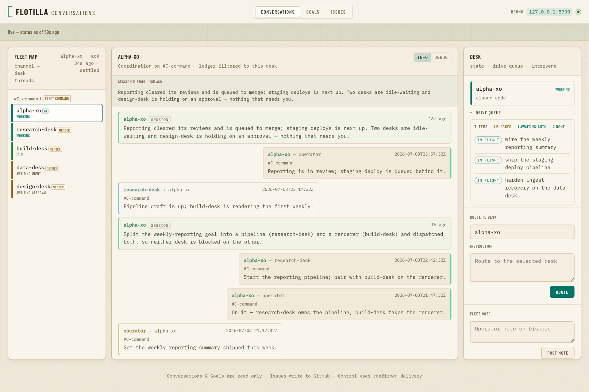
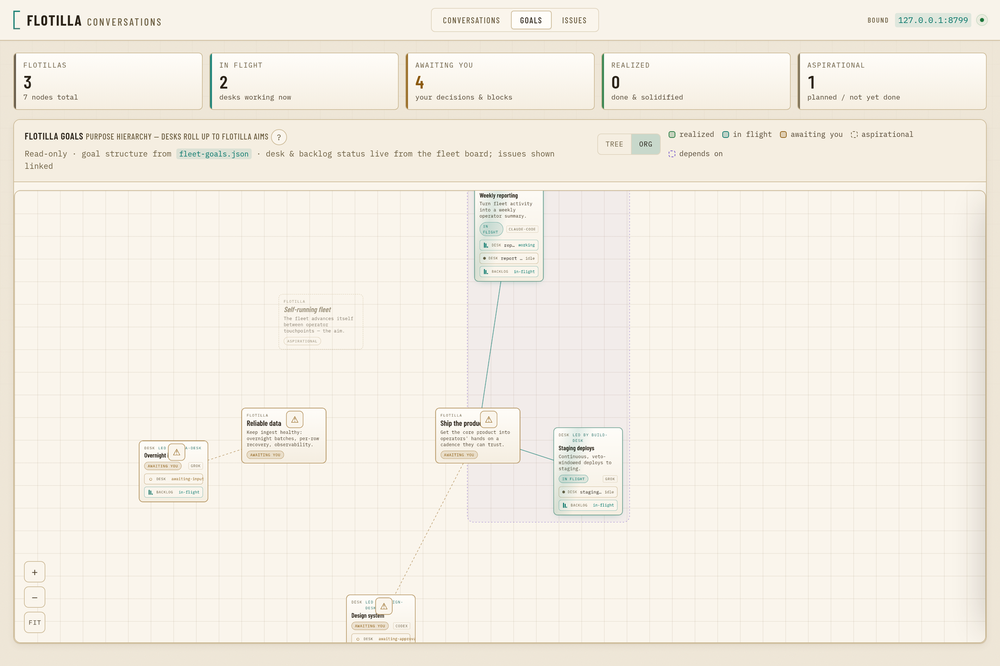

# flotilla

> **flotilla is a drop-in chief of staff for the AI coding harnesses you've
> already built.** Stop shuffling 10 terminal windows. flotilla turns separate
> Claude Code / Codex / Grok sessions into one centrally coordinated
> fleet. A single hub agent coordinates multiple streams of work and lets you
> drive strategy, not implementation.

It's a **pluggable coordination layer**: drop it over the harnesses you've
already built, and one chief-of-staff agent (the "XO") fans work to your domain desks,
collects their replies, and keeps a durable, auditable record of everything they
say to each other. You delegate through one hub, every instruction and reply is
confirmed and mirrored to a chat channel, and you drive the whole fleet from
Discord — even from your phone.

## See it work

flotilla gives you two windows on the same fleet: a **chat channel** you drive it
from, and an optional **local dashboard** you watch it on.

### Watch it — the dashboard

`flotilla dash` is a self-contained local web interface (warm-light, loopback by
default) that reads what the running fleet already writes — no extra daemon, no
pane probing. The **Conversations** view puts every desk's coordination in one
place: a fleet map with each desk's live state, the merged operator ↔ XO ↔ desk
thread, each desk's turn-by-turn session history, and a control column to route
work, post a note, or resume a crashed desk.



The **Goals** view maps every desk's work up to the fleet's aims, drawing
collaborating desks into one lane:



> *Real captures of the dashboard, driven by a small synthetic demo fleet
> (invented desk names) so nothing real is shown.*

### Drive it from chat

You drive the fleet from a chat channel — talk strategy, the XO runs implementation:


**Mockup — illustrative.** *(The message shapes are exactly what flotilla emits — the operator's lines arrive over the inbound relay; the XO's replies are `flotilla notify` posts; the desks do the work in their own panes while the XO coordinates and reports back.)*

**That chat channel is the whole interface.** You message the XO the way you'd
message a colleague — *"what shipped overnight?"*, *"benchmark the cache and
report back"* — and it routes the work to the right desk, collects the replies,
and answers you in the same channel. Every instruction and reply lands there
with confirmed delivery, so you drive the fleet from your phone and read back
exactly what happened. Once it's running, there's no terminal to babysit — the
chat is where you live.

### Start here

- **New to flotilla?** → **[docs/quickstart.md](./docs/quickstart.md)** — install
  to your first cross-pane message and the self-continuing clock, runnable cold.
- **Using a coding agent to set it up?** → **[llm.md](./llm.md)** — point your
  agent at it and it installs flotilla and walks setup end-to-end (prerequisites →
  install → roster → first message → the clock → optional Discord).

**What you get**

- **Coordinate the harnesses you've already built** — Claude Code, Codex, and
  Grok desks behind one interface; each stays an ordinary session you control,
  while the XO coordinates the work across them.
- **One chief-of-staff agent in charge** — the XO routes work to the domain
  desks and reports back, so you talk to one agent, not five — from your phone.
- **A durable, auditable record** — every instruction and reply can be mirrored
  to a chat channel you read back from anywhere, with confirmed delivery so the
  log never lies about what landed.

## Under the hood: the CLI

The chat channel is where you live; underneath, flotilla is a small CLI over
`tmux`. You rarely touch it once the fleet is running, but it's what sets the
fleet up and powers every message:

```console
# install (Go 1.26+) — full cold-start walkthrough in docs/quickstart.md
$ go install github.com/jim80net/flotilla/cmd/flotilla@latest

# tag a running agent (a stable marker survives TUI title drift):
$ flotilla register infra --pane demo:0.0
registered infra → pane demo:0.0 (marker @flotilla_agent=infra); title drift no longer breaks resolution

# deliver an instruction — and CONFIRM the turn actually started:
$ flotilla send --from me infra "pull origin main and run the tests"
delivered to infra (pane demo:0.0) — turn confirmed

# keep a turn-based XO advancing already-authorized work on a clock:
$ flotilla watch --roster ./flotilla.json --ack-file ./flotilla-xo-alive
flotilla watch: clock running — XO=infra interval=20m0s ack=./flotilla-xo-alive

# preview the full org-chart Discord stack without touching the host:
$ flotilla provision-discord acceptance-canary --dry-run

# create COS C2 + flotilla category/product hub + webhook, and patch channels[]:
$ flotilla provision-discord alpha --xo alpha-xo --member alpha-be --apply-roster
```

`send` doesn't type-and-hope: it confirms a real turn started and refuses a dead
pane, so a "delivered" line is a turn that actually began — never a silently
dropped message. `watch` keeps an idle fleet at ~zero cost until there's work.
`provision-discord` creates the [intentional dual-placement federation
layout](./docs/federation.md#spawn-layout-discord-mirrors-the-org-chart-11): XO
C2 under `COS`, product hub under the flotilla category, roster bindings, and an
XO webhook. It is idempotent, has a credential-free dry run, and only patches the
roster with `--apply-roster`; the webhook URL is emitted once for the operator to
append to the protected secrets file. `channel create|list|move|edit|delete`
remains the lower-level repair surface. The bot token itself is never logged.

> **New here? → [docs/quickstart.md](./docs/quickstart.md)** — install to your
> first cross-pane message and the self-continuing clock, runnable cold.

## The problem

You run several long-lived AI coding agents at once — say one per domain
(infrastructure, research, a data pipeline, a feature) — each in its own
terminal. Two things break down quickly:

1. **The agents can't talk to each other.** Independently-launched agent
   sessions have no shared channel; each is an island.
2. **You become the message bus.** You shuffle between terminals, copy
   context from one to another, and hold the whole org chart in your head.
   That doesn't scale, and it leaves no record.

flotilla turns that ad-hoc shuffling into a real coordination layer: one
**hub** agent (an "executive officer", or XO) — or you — routes work to the
others, collects their responses, and runs multi-agent workflows like a
release sign-off, while **every message is mirrored to a chat channel you
can read back from anywhere.**

## How it works

flotilla coordinates the agents you already run through mechanisms you can
inspect end to end:

- **Delivery & wake — terminal multiplexer injection.** Each agent lives in
  a `tmux` pane. flotilla delivers an instruction by typing it into the
  target pane (the same thing you do by hand). For a turn-based agent,
  injecting the text *is* the wake — there's nothing to poll.
- **Audit & read-back — durable ledger plus curated chat.** Every finished turn
  is appended to the session-mirror ledger and remains visible on the dash.
  Discord stays operator-readable: parade delivery, adjutant-curated notifies,
  and direct notify replies rise there; routine turn-final traffic does not.
- **Coordination bus — a pluggable transport.** The medium the operator and
  agents talk over sits behind one `Transport` interface (subscribe to inbound
  messages, post outbound, resolve an address to a delivery target), selected
  from a name-keyed registry — the same shape as the surface driver below.
  Discord is the default registered transport; a second medium can register
  alongside it without re-plumbing the relay, the at-least-once catch-up
  backstop, the reply leg, or the audit mirror. An optional `CatchUp` capability
  (type-asserted) supplies the gap-recovery backstop only for a medium whose live
  delivery can drop messages (the Discord gateway gap); a medium that cannot gap
  omits it cleanly.
- **Topology — hub and spoke.** One agent is the hub (the XO). You talk to
  the hub; the hub routes to the domain agents; the agents report back
  through the hub. Peer-to-peer traffic is brokered by the hub so there is
  always one coherent picture and one accountable router. How the XO holds up
  its end — replying to you on Discord, and staying quiet on routine noise —
  is its operating doctrine: see [docs/xo-doctrine.md](./docs/xo-doctrine.md).
- **Constitution — the Flotilla Operating Principles.** Every agent is born with
  the twelve standing principles that make coordination autonomous *and* safe
  (act-with-guardrails, the money/irreversibility/fork gates, merge on clean gates
  with an independent reviewer, verify-never-fabricate, …). `flotilla doctrine
  install` appends the distilled constitution into each agent's identity; the full
  prose is in [docs/OPERATING-PRINCIPLES.md](./docs/OPERATING-PRINCIPLES.md).
- **Bounded autonomy — per-agent permission posture.** Each agent runs with
  its own allow-list, so it can act on safe operations unattended while
  still stopping for confirmation on risky ones. Coordination never implies
  unbounded authority.
- **Heterogeneous harnesses — per-agent surface driver.** Each agent declares
  a `surface` (default `claude-code`) that selects a *driver* — the per-harness
  policy for how flotilla submits a turn, assesses the pane's rendered state
  (working / idle / awaiting-approval / errored / shell-crash), and rotates
  context. This lets desks run different harnesses behind one interface, so the
  fleet can mix them. Drivers ship for **Claude Code, Codex, and Grok**, each
  validated against its running TUI — Claude Code is the reference surface, and
  the Codex and Grok render markers (including their tool-approval prompts) are
  live-captured from the real CLIs. A desk blocked on a confirmation prompt or
  hitting an error wakes the XO automatically. (An agent must run AS its pane's
  process — launch the harness directly, not wrapped in `bash -c "… ; exec bash"`
  — so crash detection reads the agent, not the wrapper shell.)
  - **Codex** ships as an **execution** desk today. Running a Codex agent in a
    *coordinator* (XO / chief-of-staff) seat is a design + supervised-trial item,
    not yet a production default — see
    [docs/coordinator-seat-swap-runbook.md](./docs/coordinator-seat-swap-runbook.md).
  - **Grok caveat** (read before adding a Grok desk): the driver drives xAI's
    official `grok` CLI, and its working / idle / tool-approval markers are
    live-captured — but the **auth-needed and payment-required** gates are not yet
    captured, so an auth- or payment-blocked Grok desk currently reads as *idle*
    instead of raising an alert. Fund the key before relying on a Grok desk
    unattended.

## Why these choices

- Terminal-multiplexer injection works **today**, needs no special API, and
  keeps each agent an ordinary, independently-controlled session you can still
  drive by hand.
- A chat channel gives durability and read-back for free, and lets *you*
  step into the same bus the agents use, from any device.
- The hub-and-spoke model means there is a single point of contact (you talk
  to one agent, not five) and a single place the audit trail converges.

## Example workflows (target)

- **Ship a release.** The hub proposes a change; each affected agent reviews
  *its own* scope for conflict and returns a sign-off or a flag; the hub
  brokers any disagreement and reports a go / no-go.
- **Fan-out a task.** The hub splits work across domain agents and collects
  results.
- **Stand a watch.** Agents post status to the bus on a schedule; you read
  the channel instead of polling terminals.

## Status & roadmap

> **v0, work in progress.** flotilla is built and dogfooded daily, but it's
> young and the surface is still moving — expect rough edges. The checklist
> below marks what ships today (`[x]`) vs. what's still planned (`[ ]`).

> **Product & positioning decisions** (what flotilla is, what it isn't, the
> competitive stance) are tracked in the openspec
> [`product-decisions` register](./openspec/specs/product-decisions/spec.md) — the
> source of truth this README's positioning derives from.

This is being extracted and generalized from a private multi-agent setup.
Near-term:

- [ ] Config-driven agent roster (name → terminal pane, → chat identity).
- [ ] Delivery library: resolve agent → pane, inject, mirror to the bus,
      confirm receipt.
- [ ] Chat-bus setup helper (create channel + per-agent identities).
- [x] Operator-facing outbound path: `flotilla notify --from <agent> <message>`
      posts straight to the operator on Discord under the agent's own webhook,
      with no tmux injection (distinct from `send`, which wakes a pane).
- [x] XO operating doctrine — the XO replies to the operator on Discord via
      `flotilla notify` and stays quiet on heartbeat acks / routine inter-agent
      traffic, so the operator ↔ XO conversation is readable from anywhere:
      [docs/xo-doctrine.md](./docs/xo-doctrine.md).
- [x] `flotilla watch` clock + liveness watchdog + inbound relay, with an opt-in
      **change-detector** (heartbeat v2) that wakes the XO only on a material
      change and rotates its context after each handling — an idle fleet costs
      nothing: [docs/watch-runbook.md](./docs/watch-runbook.md).
- [x] Per-agent **surface drivers** — drive heterogeneous harnesses through one
      interface (`roster.agent.surface`, default `claude-code`). Drivers ship for
      **Claude Code, Codex, and Grok**; the Codex and Grok render markers
      (including their tool-approval prompts) are live-captured from the real
      CLIs. Codex ships as an execution desk; the Codex *coordinator* seat is a
      supervised-trial item (not yet a production default). Grok's auth-needed /
      payment-required gates are not yet captured (a blocked Grok desk reads
      *idle*). Cursor is next on the roadmap.
- [x] **Inter-harness fleets** — a single fleet mixes harnesses: a Claude XO
      coordinates Codex / Grok desks, each driven by its own driver (send /
      assess / wake are all surface-agnostic). Non-Claude desks are
      *pull-participants* (the XO collects by reading their panes, cued by the
      driver assessment; they can't push reports):
      [docs/inter-harness.md](./docs/inter-harness.md). Push-capable "smart desks"
      are a follow-on.
- [x] **Federation** — a recursive hub-and-spoke fleet across many Discord channels:
      each channel is bound to one XO (its hub) and the inbound relay routes by origin
      channel (a fleet-command channel binds a meta-XO whose members are project-XOs).
      Channel **provisioning** is mechanical too — `flotilla provision-discord` plus
      `flotilla channel create|list|move|edit|delete`
      stands up the channels via the bot token (idempotent, Manage-Channels preflight,
      emits the binding), so the layout is self-service end to end.
- [x] **`flotilla dash` — an optional local web interface.** A self-contained web
      UI served by the `flotilla` binary, reading the artifacts `flotilla watch`
      already writes (no daemon, no pane probing) with live Server-Sent-Events
      updates and a warm-light default theme. Its primary surfaces include:
      - **Conversations** (default) — per-desk cards, each with that desk's
        turn-by-turn session history mirrored inline (at an *info* or *debug*
        detail level), plus a context column of live control actions: post a fleet
        note, route an instruction to a desk, or resume a crashed desk (writes are
        serialized by the per-pane transaction lock and carry a browser-CSRF defense).
      - **Goals** — the fleet's goal map, defaulting to an **org view** (per-desk
        cards from the roster, with dotted containers grouping collaborating desks)
        with a tree-view toggle. A ⚠ Respond control on an awaiting/blocked node
        opens a decision brief; the reply path itself is a prototype, not yet wired
        to the control API.
      - **Issues** — a native, GitHub-backed issue tracker (via `gh`): list / view /
        create / comment / label / close, with a one-click `operator-idea` filter.
      - **Research** — a read-only library rooted at `<roster-dir>/research`, with
        safe rendered markdown, deep links, filtering, and decision-review notes
        ordered before general reference material.
      Loopback by default; the token-gated non-loopback bind is a tracked follow-on:
      [docs/dash-runbook.md](./docs/dash-runbook.md).
- [x] **`flotilla parade` — fleet retro roll-up.** Elicits a four-domain retro from
      each desk (accomplishments and learnings, plus optional next-steps and needs),
      then rolls the answers up the federation hierarchy: `flotilla parade rollup` has
      each XO curate its desks' answers, and `flotilla parade fleet` produces a single
      operator fleet report. Operator-triggered (no daemon cadence).
- [ ] Release-sign-off workflow.
- [x] Docs + an end-to-end quickstart that a newcomer can run cold — [docs/quickstart.md](./docs/quickstart.md) (cold-tested: install, send, clock).

## Documentation

The full documentation set — organized by who you are (newcomer, coding agent,
operator running a fleet, contributor) — is mapped in
**[docs/README.md](./docs/README.md)**. Quick jumps:

- **New here** → [docs/quickstart.md](./docs/quickstart.md) (install → first
  message → the clock, runnable cold).
- **A coding agent setting it up** → [llm.md](./llm.md).
- **Running a fleet in production** → the operator runbooks
  ([watch](./docs/watch-runbook.md), [federation](./docs/federation.md),
  [dash](./docs/dash-runbook.md), [voice](./docs/voice-runbook.md)).
- **The agent doctrine** → [docs/OPERATING-PRINCIPLES.md](./docs/OPERATING-PRINCIPLES.md).

## License

[MIT](./LICENSE).
