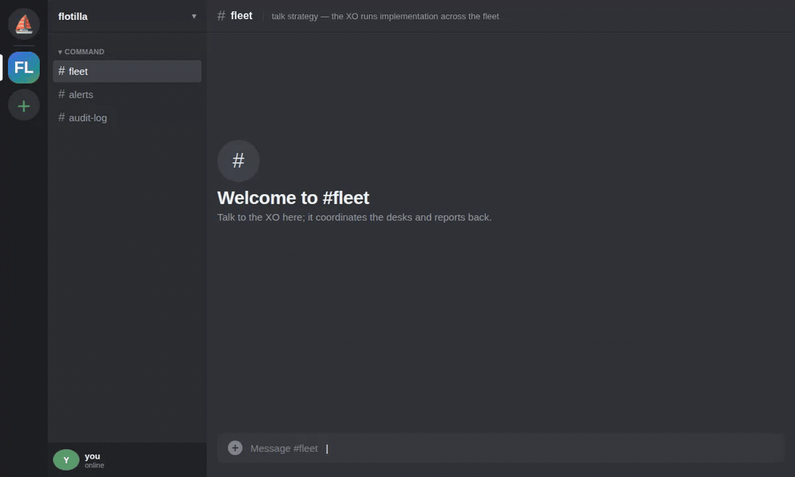

# flotilla

> **flotilla is a drop-in chief of staff for the AI coding agents you already
> run.** It turns separate Claude Code / Aider / OpenCode / Grok sessions into
> one coordinated fleet — a single hub agent routes the work and reports back —
> and you drive the whole thing from a chat channel on your phone.

It's a **pluggable coordination layer**: drop it over the harnesses you already
run, and one chief-of-staff agent (the "XO") fans work to your domain desks,
collects their replies, and keeps a durable, auditable record of everything they
say to each other. No new daemon, no hosted service, no lock-in — just `tmux` and
a chat channel you already have.

## See it work



*(A real run — an XO routes work to a backend desk, collects the report back, and starts the clock; every hop is a confirmed delivery. [Source cast](docs/assets/flotilla-demo.cast).)*

Point flotilla at an agent you already run, then drive it from one command:

```console
# install (Go 1.26+) — full cold-start walkthrough in docs/quickstart.md
$ go install github.com/jim80net/flotilla/cmd/flotilla@latest

# tag the agent you already run (a stable marker survives TUI title drift):
$ flotilla register infra --pane demo:0.0
registered infra → pane demo:0.0 (marker @flotilla_agent=infra); title drift no longer breaks resolution

# deliver an instruction — and CONFIRM the turn actually started:
$ flotilla send --from me infra "pull origin main and run the tests"
delivered to infra (pane demo:0.0) — turn confirmed

# keep a turn-based XO advancing already-authorized work on a clock:
$ flotilla watch --roster ./flotilla.json --ack-file ./flotilla-xo-alive
flotilla watch: clock running — XO=infra interval=20m0s ack=./flotilla-xo-alive
```

`send` doesn't type-and-hope: it confirms a real turn started and refuses a dead
pane, so a "delivered" line is a turn that actually began — never a silently
dropped message. `watch` keeps an idle fleet at ~zero cost until there's work.

> **New here? → [docs/quickstart.md](./docs/quickstart.md)** — install to your
> first cross-pane message and the self-continuing clock, runnable cold.

**What you get**

- **Coordinate the agents you already run** — Claude Code, Aider, OpenCode, and
  Grok desks behind one interface; each stays an ordinary session you control,
  so opting in costs you nothing and you can walk away anytime.
- **One chief-of-staff agent in charge** — the XO routes work to the domain
  desks and reports back, so you talk to one agent, not five — from your phone.
- **A durable, auditable record** — every instruction and reply can be mirrored
  to a chat channel you read back from anywhere, with confirmed delivery so the
  log never lies about what landed.

## The problem

You run several long-lived AI coding agents at once — say one per domain
(infrastructure, research, a data pipeline, a feature) — each in its own
terminal. Two things break down quickly:

1. **The agents can't talk to each other.** Independently-launched agent
   sessions have no shared channel; each is an island.
2. **You become the message bus.** You shuffle between terminals, copy
   context from one to another, and hold the whole org chart in your head.
   That doesn't scale, and it leaves no record.

flotilla turns that ad-hoc shuffling into a real coordination layer: one
**hub** agent (an "executive officer", or XO) — or you — routes work to the
others, collects their responses, and runs multi-agent workflows like a
release sign-off, while **every message is mirrored to a chat channel you
can read back from anywhere.**

## How it works

flotilla is deliberately built on substrate you already have, not a new
daemon or a hosted service:

- **Delivery & wake — terminal multiplexer injection.** Each agent lives in
  a `tmux` pane. flotilla delivers an instruction by typing it into the
  target pane (the same thing you do by hand). For a turn-based agent,
  injecting the text *is* the wake — there's nothing to poll.
- **Audit & read-back — a chat channel.** Every instruction and every reply
  is also posted to a dedicated Discord channel, each agent under its own
  webhook identity. That gives you a durable, timestamped, phone-readable
  transcript of all coordination — the audit trail is a first-class feature,
  not an afterthought.
- **Topology — hub and spoke.** One agent is the hub (the XO). You talk to
  the hub; the hub routes to the domain agents; the agents report back
  through the hub. Peer-to-peer traffic is brokered by the hub so there is
  always one coherent picture and one accountable router. How the XO holds up
  its end — replying to you on Discord, and staying quiet on routine noise —
  is its operating doctrine: see [docs/xo-doctrine.md](./docs/xo-doctrine.md).
- **Bounded autonomy — per-agent permission posture.** Each agent runs with
  its own allow-list, so it can act on safe operations unattended while
  still stopping for confirmation on risky ones. Coordination never implies
  unbounded authority.
- **Heterogeneous harnesses — per-agent surface driver.** Each agent declares
  a `surface` (default `claude-code`) that selects a *driver* — the per-harness
  policy for how flotilla submits a turn, assesses the pane's rendered state
  (working / idle / awaiting-approval / errored / shell-crash), and rotates
  context. This lets a desk run Claude Code, **Aider**, … behind one interface,
  so the fleet can mix harnesses. `claude-code`, `aider`, `opencode`, and `grok`
  ship today. The Aider driver is the first to surface *awaiting-approval* and
  *errored* states, so a desk blocked on a confirmation prompt or hitting an error
  wakes the XO automatically; the OpenCode driver does the same with claude-style
  polarity (its working indicator persists the whole turn). (Like `claude-code`, an
  agent must run AS its pane's process — e.g. launch `aider …` / `opencode` directly,
  not wrapped in `bash -c "… ; exec bash"` — so crash detection reads the agent, not
  the wrapper shell.)
  - **`grok` caveats** (read before adding a Grok desk): (1) **Grok auto-executes
    shell commands and file edits WITHOUT prompting** — it has no per-action approval
    gate, so a Grok desk acts on its environment unprompted (an operational hazard);
    the driver emits a reduced state set accordingly. (2) The `grok` driver's render
    markers are **source-verified, not yet live-captured** (Grok is xAI-only/metered,
    so there is no $0 validation path) — live-capture validation is pending a funded
    xAI session.

## Why these choices

- Terminal-multiplexer injection works **today**, needs no special API, and
  keeps each agent an ordinary, independently-controlled session — you don't
  give anything up to opt in.
- A chat channel gives durability and read-back for free, and lets *you*
  step into the same bus the agents use, from any device.
- The hub-and-spoke model means there is a single point of contact (you talk
  to one agent, not five) and a single place the audit trail converges.

## Example workflows (target)

- **Ship a release.** The hub proposes a change; each affected agent reviews
  *its own* scope for conflict and returns a sign-off or a flag; the hub
  brokers any disagreement and reports a go / no-go.
- **Fan-out a task.** The hub splits work across domain agents and collects
  results.
- **Stand a watch.** Agents post status to the bus on a schedule; you read
  the channel instead of polling terminals.

## Status & roadmap

> **v0, work in progress.** flotilla is built and dogfooded daily, but it's
> young and the surface is still moving — expect rough edges. The checklist
> below marks what ships today (`[x]`) vs. what's still planned (`[ ]`).

This is being extracted and generalized from a private multi-agent setup.
Near-term:

- [ ] Config-driven agent roster (name → terminal pane, → chat identity).
- [ ] Delivery library: resolve agent → pane, inject, mirror to the bus,
      confirm receipt.
- [ ] Chat-bus setup helper (create channel + per-agent identities).
- [x] Operator-facing outbound path: `flotilla notify --from <agent> <message>`
      posts straight to the operator on Discord under the agent's own webhook,
      with no tmux injection (distinct from `send`, which wakes a pane).
- [x] XO operating doctrine — the XO replies to the operator on Discord via
      `flotilla notify` and stays quiet on heartbeat acks / routine inter-agent
      traffic, so the operator ↔ XO conversation is readable from anywhere:
      [docs/xo-doctrine.md](./docs/xo-doctrine.md).
- [x] `flotilla watch` clock + liveness watchdog + inbound relay, with an opt-in
      **change-detector** (heartbeat v2) that wakes the XO only on a material
      change and rotates its context after each handling — an idle fleet costs
      nothing: [docs/watch-runbook.md](./docs/watch-runbook.md).
- [x] Per-agent **surface drivers** — drive heterogeneous harnesses through one
      interface (`roster.agent.surface`, default `claude-code`). `claude-code`,
      `aider`, and `opencode` ship today; both `aider` and `opencode` emit the full
      assessed-state set (incl. awaiting-approval / errored). Build + validate is $0
      via a local model (ollama); running a paid-model desk is a separate operator
      spend choice. The `grok` driver also ships (source-verified; reduced state set
      — Grok auto-executes unprompted). Cursor is next on the roadmap.
- [x] **Inter-harness fleets** — a single fleet mixes harnesses: a Claude XO
      coordinates Aider / OpenCode / Grok desks, each driven by its own driver
      (send / assess / wake are all surface-agnostic — proven live with an OpenCode XO
      driving a mixed fleet). Non-Claude desks are *pull-participants* (the XO collects
      by reading their panes, cued by the driver assessment; they can't push reports):
      [docs/inter-harness.md](./docs/inter-harness.md). Push-capable "smart desks" are a
      follow-on.
- [ ] Release-sign-off workflow.
- [x] Docs + an end-to-end quickstart that a newcomer can run cold — [docs/quickstart.md](./docs/quickstart.md) (cold-tested: install, send, clock).

## Research log

Durable kill-or-keep verdicts from experiments and evaluations, so a future
session reads the verdict instead of re-deriving it — see
[research/](./research/README.md). (e.g. *OCR as a third PR reviewer → shelved*.)

## License

[MIT](./LICENSE).
