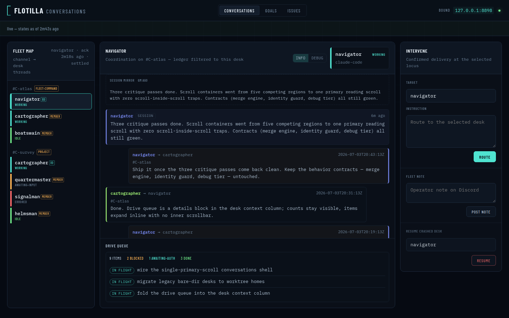
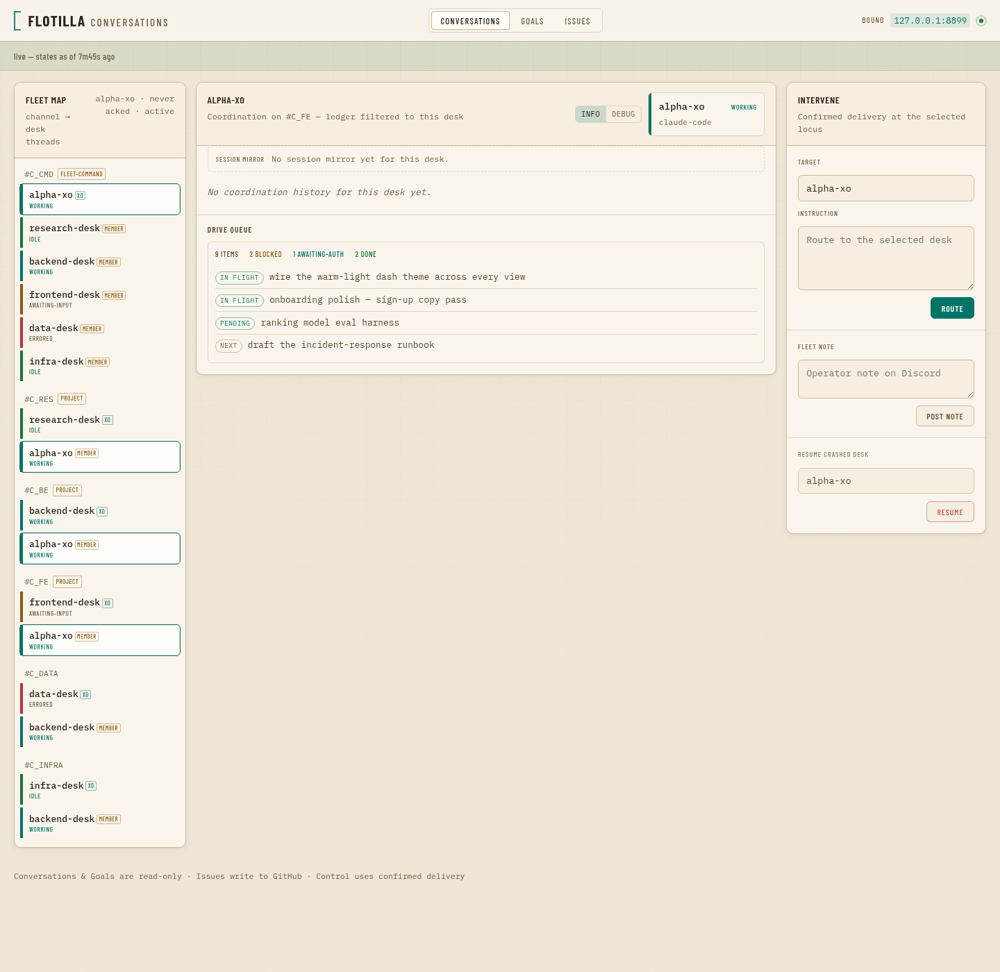
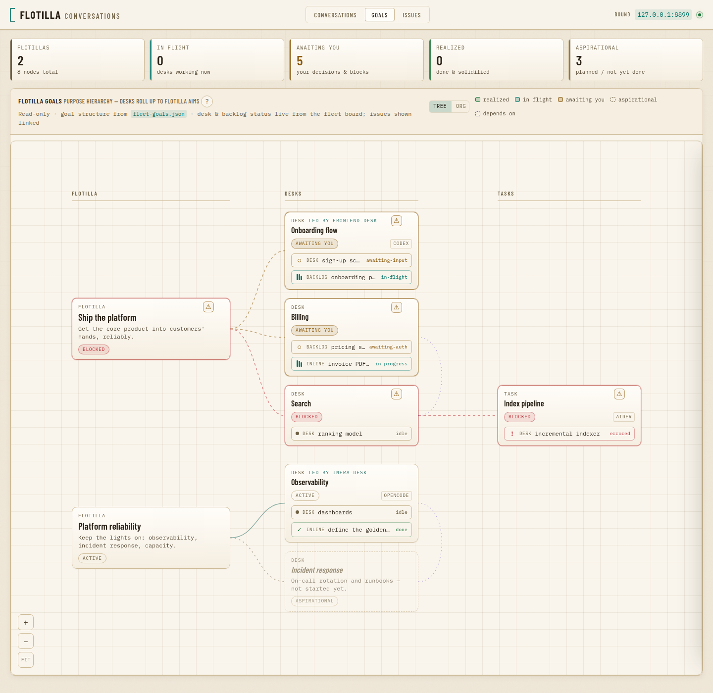
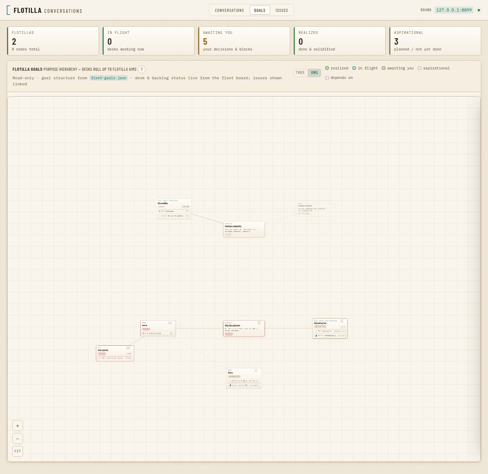
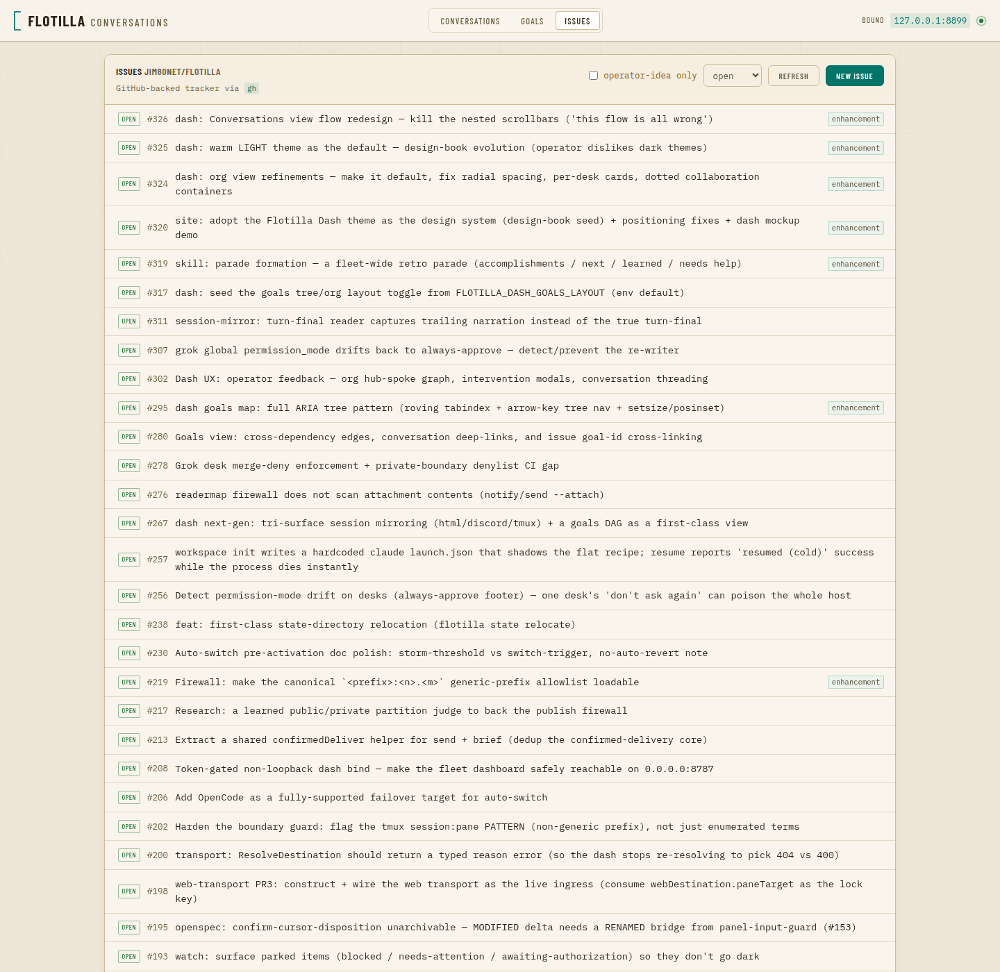
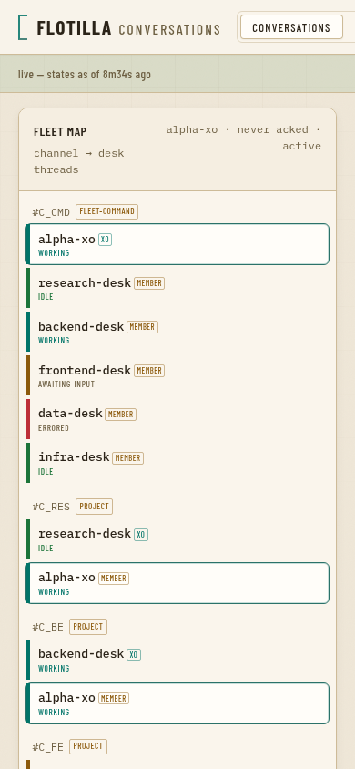

# Flotilla design book

The visual language flotilla uses across its surfaces — the local **dash**
(`internal/dash/assets/`) and the public **landing site** (`site/`). One system,
so the product and its marketing read as the same thing.

Flotilla ships coordinated **warm-light and dark instrument themes**. A first
visit follows the operating-system preference; the header control stores an
explicit light/dark override in the browser for later visits. Warm light uses a
calm parchment ground; dark uses deep blue-charcoal surfaces with brighter
signals and readable muted telemetry. In both, the goal is an instrument you can
read at a glance where **every
section is clearly its own card** — separation comes from surface contrast +
shadow + border, not from cramming color.

The source of truth for the tokens is the `:root` fallback plus the
`:root[data-theme="dark"]` override in
`internal/dash/assets/dash.css`. When a token changes there, update this book;
components consume only the shared semantic vocabulary.

---

## 1. Voice of the surface

A **fleet command console** rendered either on warm paper or deep blue-charcoal:
layered instrument panels, a teal signal, an ochre accent for the chat/audit bus,
restrained condensed display type over a monospace body. Both palettes are calm,
instrument-like, and legible at a glance. The dash is a working instrument; the
landing page borrows its calm so the product you install matches the page that
sold it.

---

## 2. Token architecture — semantic layer + legacy aliases

The palette is expressed in two layers:

1. A **semantic layer** — `--ground / --surface / --raised / --card`, the two
   `--line*` borders, the `--ink*` scale, the accents, and the state colors. This
   is the canonical vocabulary. **To retheme, change values here.**
2. A **legacy-alias layer** — `--abyss* / --hull`, mapping the historical
   dark-theme names onto the semantic tokens so every existing `var(--abyss-2)`
   reference in the CSS keeps resolving. No JavaScript reads token names, so
   aliasing is safe; new rules should reach for the semantic names.

Every dark-toned wash, border, or glow that used to be a hard-coded `rgba()` of a
hue is now written as `color-mix(in srgb, var(--token) N%, transparent)`, so it
**re-derives from the token** instead of pinning a dead color. That is why each
palette can re-theme the whole instrument from one token block.

`theme.js` resolves the stored `flotilla-theme-v1` choice before the stylesheet
loads. With no stored override it follows `prefers-color-scheme`; the header
control writes an explicit `light` or `dark` choice. The same script and storage
key are shared by the dashboard, Research, and Parade pages.

The `:root` block, verbatim:

```css
:root {
  color-scheme: light;
  /* ── surfaces (warm light) — page is the deepest warm tone so panels pop ── */
  --ground:     #efe7d8;   /* the page — warm parchment */
  --surface:    #faf5ec;   /* panels, threads, log panes — raised warm ivory */
  --raised:     #f5eee1;   /* chrome: headers, tab strips, inputs, detail bodies */
  --card:       #fffdf9;   /* top surface — hover/selected/active/node fills */

  /* ── lines — warm taupe, deliberately visible for section separation ── */
  --line:       #cdbb98;   /* primary border / hairline */
  --line-soft:  #e0d5c0;   /* faint dividers, grid, sub-panel edges */

  /* ── ink — warm near-black scale ── */
  --ink-1:      #1f1810;   /* strongest — active toggle labels */
  --ink:        #2b2318;   /* headings / high-emphasis */
  --ink-2:      #544632;   /* body text */
  --ink-3:      #6d5f42;   /* muted / meta / labels (AA on the page) */
  --solid-ink:  #ffffff;   /* text on saturated state/accent fills */

  /* ── accents + state (deep, AA-as-text on the warm surfaces) ── */
  --cyan:       #017468;   /* primary signal — links, active, in-flight */
  --cyan-dim:   #2b7269;   /* secondary teal — kickers, owners, hover borders */
  --cyan-strong:#015a51;   /* primary-button hover (darker, not brighter) */
  --amber:      #8c5a0c;   /* ochre bus accent — chat/audit, awaiting-you */
  --violet:     #6f4ec9;   /* secondary accent — session output, speakers */
  --ok:         #1c7439;   /* success / idle / realized (green) */
  --ok-dim:     #1c7439;   /* realized swatch border */
  --warn:       var(--amber);
  --err:        #bd2f38;   /* error / blocked / crashed (red) */

  /* ── derived surface treatments (light-native elevation, not dark glow) ── */
  --chrome:     rgba(250, 246, 238, .82);        /* translucent header over blur */
  --scrim:      rgba(43, 35, 24, .34);           /* modal overlay — warm dark */
  --grid-line:  rgba(120, 100, 60, .10);         /* atmosphere + goals-canvas grid */
  --shadow-sm:  0 1px 2px rgba(74, 58, 30, .06);
  --shadow:     0 1px 2px rgba(74, 58, 30, .05), 0 4px 12px -2px rgba(74, 58, 30, .09);
  --shadow-lg:  0 18px 44px -16px rgba(58, 44, 20, .30);

  --display: "Barlow Condensed", ui-sans-serif, system-ui, sans-serif;
  --mono: "IBM Plex Mono", ui-monospace, "SF Mono", Menlo, monospace;
  --r: 10px;
  --r-sm: 6px;
  --r-xs: 3px;
  --ease: cubic-bezier(.22, 1, .36, 1);

  /* ── legacy aliases (dark-theme names → semantic light tokens) ── */
  --abyss:      var(--ground);
  --abyss-1:    var(--ground);
  --abyss-2:    var(--surface);
  --abyss-3:    var(--raised);
  --hull:       var(--card);
}
```

### Surfaces (the elevation ladder)

| Token | Hex | Role |
|---|---|---|
| `--ground` (`--abyss`) | `#efe7d8` | the page — the **deepest** warm tone, so panels sit above it |
| `--surface` (`--abyss-2`) | `#faf5ec` | panels, conversation threads, log panes — raised warm ivory |
| `--raised` (`--abyss-3`) | `#f5eee1` | chrome: headers, tab strips, inputs, detail bodies |
| `--card` (`--hull`) | `#fffdf9` | the top surface — hover / selected / active / node fills |

The ladder runs page → surface → raised → card, from the deepest warm paper up to
near-white. Contrast between rungs — plus a soft `--shadow` and a visible `--line`
— is what makes each section read as its own card. **This is the fix for "the
sections are hard to see."**

### Lines, ink, and accents

| Token | Hex | Role |
|---|---|---|
| `--line` | `#cdbb98` | primary border / hairline (deliberately visible) |
| `--line-soft` | `#e0d5c0` | faint dividers, grid, sub-panel edges |
| `--ink-1` | `#1f1810` | strongest ink — active toggle labels |
| `--ink` | `#2b2318` | headings / high-emphasis text |
| `--ink-2` | `#544632` | body text |
| `--ink-3` | `#6d5f42` | muted / meta / labels |
| `--cyan` | `#017468` | primary signal — links, active, in-flight |
| `--cyan-dim` | `#2b7269` | secondary teal — kickers, owners, hover borders |
| `--amber` | `#8c5a0c` | ochre bus accent — the chat/audit bus, awaiting-you |
| `--violet` | `#6f4ec9` | secondary accent — session output, per-speaker |
| `--ok` | `#1c7439` | success / idle / realized |
| `--err` | `#bd2f38` | error / blocked / crashed |

Accents are used **sparingly** — a surface is mostly paper + ink, with teal and
ochre carrying meaning, never decoration.

---

## 3. State colors — the semantics, and why these exact hues

The dash speaks a fixed status vocabulary. Each state maps to one hue, used on the
node/desk **rails**, the state **pills**, the goal **tiles**, and the graph
**edges**:

| State | Token | Meaning |
|---|---|---|
| realized / idle | `--ok` `#1c7439` | done & solidified; a desk resting at an idle composer |
| in-flight / working | `--cyan` `#017468` | a desk mid-turn; a goal being actively driven |
| awaiting-you | `--amber` `#8c5a0c` | an operator decision or authorization is gating progress |
| blocked / crashed / errored | `--err` `#bd2f38` | a genuine block or a dead process |
| aspirational | ghost `--ink-3`, dashed | planned, not yet started (receded, italic, dashed border) |

**Why they are deep.** On a light surface a bright status hue fails contrast as
text. These five are tuned so that **every one clears WCAG AA (≥ 4.5:1) as small
text on the warm surfaces** — verified against the page (`#efe7d8`), the panel
(`#faf5ec`), and the card (`#fffdf9`):

| Color | vs page | vs panel | vs card |
|---|---|---|---|
| `--ok` `#1c7439` | 4.74 | 5.28 | 5.66 |
| `--cyan` `#017468` | 4.62 | 5.14 | 5.51 |
| `--amber` `#8c5a0c` | 4.77 | 5.40 | 5.77 |
| `--err` `#bd2f38` | 4.71 | 5.33 | 5.70 |
| `--violet` `#6f4ec9` | 4.74 | 5.36 | 5.73 |

They also pass a colour-vision-deficiency separation check as a categorical set,
and — per data-viz practice — **never travel on color alone**: every state ships
with a text label, an icon, or a shaped rail, so a red/green-confusable viewer
still reads it. (The teal sits a hair under the categorical chroma floor, which is
acceptable precisely because it is a reserved status color that always carries a
label.)

**Fills and borders re-derive, they are not separate hexes.** A state wash is
`color-mix(in srgb, var(--state) N%, transparent)` (≈ 10–16% for a fill, ≈ 40–55%
for a border). Two consequences: a state tint is always a faithful tint of its
own token, and re-theming a state means editing **one** hex.

```css
.gpill-in-flight { color: var(--cyan); border-color: color-mix(in srgb, var(--cyan) 45%, transparent); background: color-mix(in srgb, var(--cyan) 10%, transparent); }
```

**GitHub label chips** are a special case: their hue comes from external data, not
our palette, and GitHub's defaults are light. So the chip keeps its text in
`--ink-2` and uses the incoming hue only as a faint tint + accent border (the hue
arrives as a `--label` custom property), guaranteeing legibility on paper for
*any* label color:

```css
.issue-label {
  font-size: .66rem;
  color: var(--ink-2);
  background: color-mix(in srgb, var(--label, var(--ink-3)) 16%, transparent);
  border: 1px solid color-mix(in srgb, var(--label, var(--ink-3)) 55%, var(--line));
  border-radius: 2px;
  padding: .05em .45em;
}
```

---

## 4. Typography

Two families, both from Google Fonts (unchanged across the light move):

- **Display — `Barlow Condensed`** (`--display`), weights 500/600/700. A calm
  condensed grotesque for headings, the brand, kickers, node titles, tab labels.
  Kickers/labels are **uppercase with positive letter-spacing** (`.12em`–`.22em`);
  large headlines sit near neutral tracking.
- **Body — `IBM Plex Mono`** (`--mono`), weights 400/500/600. The instrument body:
  prose, install commands, the teal inline accents, status text.

| Use | Size |
|---|---|
| Section heading (`h2`) | `.88rem` display, uppercase |
| Card / node title (`h3`) | `1.0–1.2rem` display 600 |
| Body | `13px` mono, line-height `1.55` |
| Kicker / eyebrow / label | `.55–.72rem` display/mono, uppercase, tracked |
| Meta / caption | `.62–.72rem` mono, `--ink-3` |

**Do:** condensed display for headings; mono for anything you'd read or type.
**Don't:** heavy geometric display weights or tight negative tracking — that reads
"techno startup", the opposite of the instrument voice.

---

## 5. Component patterns

- **Panel** — `--surface` fill, `1px solid --line` border, a soft `--shadow`, and
  `--r`/`--r-sm` radius. Raised chrome (headers, tab bars) uses `--raised`. The
  shadow + border is what lifts a panel off the parchment page.
- **Card** — a panel with a `--card` hover/selected fill and a `--cyan-dim` hover
  border; a small uppercase `--ink-3` eyebrow, a display title, mono body.
- **Status pill** — a small rounded chip; text in the state color, border + fill
  as `color-mix` derivations (§3). One pill per node/desk.
- **Harness badge** — a subdued, right-aligned uppercase micro-chip naming a
  surface (`grok`, `claude-code`, …). `--ink-3` on a `--line-soft` border.
- **Segmented toggle** — two/three flush buttons in a bordered group; the active
  one gets a `color-mix(in srgb, var(--cyan) 18%, transparent)` fill and `--ink-1`
  label. Used for the goals `tree|org` layout and `info|debug` verbosity toggles.
- **Buttons** — primary is a solid `--cyan` with a `--card` (near-white) label,
  darkening to `--cyan-strong` on hover; danger is `--err`; ghost is a `--line`
  border warming to `--cyan-dim` on hover. Mono label, small radius.
- **Goals canvas (command-chart)** — the hero pattern: an org node graph on a
  faint `--grid-line` canvas. Nodes are cards (`.gnode`, `--card`→`--raised`
  gradient) with a soft `--shadow-sm`, sized by scope (flotilla > desk > task);
  node border + pill color is live status (§3); realized nodes recede to a muted
  paper tone. In **org** layout the coordinator sits at center with straight spoke
  edges; in **tree** layout nodes stack in tiered altitude columns.
- **Atmosphere** — a fixed faint `--grid-line` graph grid (masked to fade at the
  edges, low opacity) plus a barely-there `multiply` grain. Subtle warmth; it sets
  the paper mood without competing with content.

Elevation on a light theme is a **shadow + border** problem, not a glow problem:
use `--shadow-sm` / `--shadow` / `--shadow-lg` (warm-brown, low-alpha) for lift;
the modal scrim is `--scrim` (warm dark), not black.

---

## 6. Motion & accessibility

- Motion is minimal: a 2.4s status pulse on the live-link dot, hover lifts, a slow
  in-flight node scan. All motion is disabled under `prefers-reduced-motion`.
- Everything meaningful is a real DOM element with a text label — map nodes, the
  status pills, the rails — so screen readers and keyboard users reach them, and
  state is never color-alone.
- **Contrast is AA by construction.** `--ink` / `--ink-2` clear AA for body and
  headings on every surface; `--ink-3` clears AA on the page; and every state
  color clears AA as text (§3). The focus ring is `2px solid var(--cyan)` — a deep
  teal that stays visible on paper.

---

## 7. Mobile

Mobile-friendly is a **requirement**, not a nicety — the product's pitch is that
you drive the fleet from your phone, so every surface must *flow* correctly on a
phone: no sideways scroll, no cramped controls, no scroll-within-scroll traps.
This section is the canonical contract. A standing UI-QA lane audits + fixes flow
on every UI change against these rules.

### 7.1 Canonical breakpoints

Two breakpoints define phone/tablet behavior across surfaces:

| Breakpoint | Name | What it governs |
|---|---|---|
| `≤ 640px` | **phone** | single-column stacking, header wrap, one-scroll release, full-bleed overlays |
| `≤ 900px` | **tablet** | touch-target minimums (both phone and tablet are touch surfaces) |
| `> 900px` | desktop | denser, mouse-precision chrome |

A surface MAY add finer component breakpoints (the landing's editorial grids
collapse at their own widths — hero at `920`, card grids at `860`, the nav strip
at `760`), but the two canonical widths above define the phone/tablet contract and
the disciplines below apply at them.

### 7.2 Touch-target minimum — 44px

Any control a **thumb drives** — tabs, buttons, segmented toggles, selects, text
inputs, close buttons, zoom controls — is a **44px** minimum hit target at
`≤ 900px`. Height-only bumps preserve the desktop horizontal rhythm; give a
segmented micro-toggle `inline-flex` so the min-height grows its box:

```css
@media (max-width: 900px) {
  .tab,
  .btn,
  .glayout-btn,
  .mv-btn,
  #filter-state,
  .ghelp,
  .gd-convo,
  .gd-close,
  .gm-close,
  .gzoomctl button { min-height: 44px; }
  .tab,
  .glayout-btn,
  .mv-btn { display: inline-flex; align-items: center; justify-content: center; }
}
```

Exception: a checkbox may stay ~22px when its **whole label row** is the 44px
target (`.filter-idea { min-height: 44px; }` with a 22px box inside).

### 7.3 Scroll discipline — one primary scroll

On a phone there is **ONE primary scroll**: the page. Never stack independent
vertical scroll containers on a phone — a capped inner pane (a chat thread, a
list rail, a drive-queue) becomes a scroll trap under a thumb.

**Design the base mobile-first**, then add inner scrollers only at wide
viewports. The Conversations shell is the reference: its base stacks the three
zones and lets the page provide the one natural document scroll (no inner scroll
boxes at all); only at `≥ 1101px` does it become a fixed app-shell where the
merged thread owns the single reading scroll:

```css
@media (min-width: 1101px) {
  .conv-thread       { flex: 1 1 auto; min-height: 0; overflow-y: auto; } /* THE one reading scroll */
}
```

A peripheral peek (the latest-state glance) is a **clamped, non-scrolling**
summary (`-webkit-line-clamp` + `overflow: hidden`), never a competing scroll
region — do not un-clamp it on a phone. A genuine pan/zoom canvas (the Goals map)
is the one allowed nested surface; give it a bounded touch height and 44px chrome,
and never let it swallow the page scroll silently.

### 7.4 No horizontal overflow

The instrument never scrolls sideways. Three rules prevent it:

1. **A clip guard at the root.** The dash uses `overflow-x: clip` (NOT `hidden` —
   `clip` does not create a scroll container, so the sticky header keeps
   sticking); the landing uses `overflow-x: hidden`.
2. **Grid/flex children carry `min-width: 0`.** A track defaults to a `min-content`
   floor; a child with a non-wrapping line will otherwise expand its track past
   the viewport. `.start-grid > * { min-width: 0; }` is the pattern.
3. **Long unbreakable tokens wrap or scroll in their box.** A URL or command in
   prose gets `overflow-wrap: anywhere`; a shell one-liner gets `overflow-x: auto`
   with `white-space: nowrap` so it scrolls within its card, not the page.

### 7.5 What collapses where

- **Dash header** — the brand + live-dot stay on row 1; the view tabs wrap to a
  full-width row (`flex: 1 1 100%`), each tab stretched (`flex: 1 1 0`); the
  dev-only bind address hides (`.bar-meta .meta-label, .bar-meta .meta-bind {
  display: none; }`), the live dot stays.
- **Conversations** — mobile-first: the base is a single stacked column (nav ·
  thread · context) that flows in the one page scroll; a two-column layout appears
  at `≥ 721px` and the fixed app-shell (thread owns the scroll) at `≥ 1101px`.
- **Goals** — the situation tiles go two-up (`≤ 640px`); the detail drawer becomes
  a full-width overlay (`width: 100%`); the map viewport takes a bounded touch
  height and 44px zoom controls.
- **Landing** — the hero 2-column → 1-column (`≤ 920px`); the section nav becomes a
  horizontal scroll strip (`≤ 760px`); card/altitude/start grids → single column;
  band vertical rhythm tightens (`≤ 600px`).

### 7.6 The test

Load each surface cold at **390px** (phone), **768px** (tablet), **1440px**
(desktop). At every width: `document.documentElement.scrollWidth` must equal the
viewport width (no sideways scroll); no thumb-driven control below 44px; no nested
scroll container on the phone except the Goals canvas. If any fails, it isn't
mobile-friendly — fix before ship.

---

## 8. Where this is used

- `internal/dash/assets/dash.css` — the source of the tokens; the live instrument.
- `internal/dash/assets/tracker.js` — passes GitHub label hues as `--label` so the
  chip styling stays in CSS (§3).
- `site/styles.css` — the landing site, styled to match (this book's first
  consumer beyond the dash itself).
- Future surfaces (docs themes, additional dash views) inherit from here.

_Keep this book generic — no deployment carries identifiers here; every example
uses the public example roles (`alpha-xo`, `research-desk`, `backend-desk`, …).
Keep it honest to the shipped `dash.css`: the `:root` block above is the contract._

---

## 9. Gallery — the warm-light palette

These historical captures document the warm-light palette. The current dark
theme uses the same separation model and semantic component rules rather than
restoring the older hard-coded dark CSS.

**Before** — legacy dark CSS (sections hard to distinguish):



**After** — warm-light default:

| View | |
|---|---|
| Conversations |  |
| Goals — tree |  |
| Goals — org |  |
| Issues |  |
| Conversations (mobile, 390px) |  |

All example data above is generic (public example roles); no deployment
identifiers appear.
