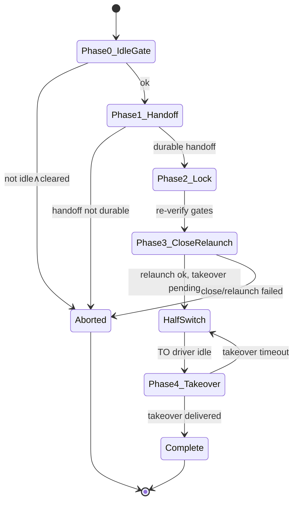

# Design — Harness / subscription switching

**Status:** Approved — grok-research design lane **complete** (operator 2026-06-29). Routed to flotilla-dev for trio + implementation. Folds: provider-wide throttle (§2), fresh-launch/empty-corpus degrade (§3.6 B+C), memex PR #21 write-side (§3.2–3.5).
**Problem:** A server-side Anthropic rate limit (`Server is temporarily limiting requests`) throttled every Claude-based desk at once and stalled the fleet. Today most desks share one harness (Claude Code) and one subscription class, so a single provider outage is a fleet-wide outage.  
**Goal:** Let a desk **fail over** to a different harness/subscription while preserving enough context to continue work — extending flotilla's existing launch-recipe + surface-driver plumbing, not replacing it.

---

## Executive summary

Flotilla already has the primitives for **inter-harness fleets** (per-agent `surface` in the roster, per-driver `Submit`/`Assess`/`Rotate`, arbitrary `launch` commands via `flotilla resume`, and context-preserving `flotilla recycle` via `RecycleBridge`). What it lacks is:

1. **Declared fallback harnesses** per desk (primary + ordered fallbacks with model prefs).
2. **Automatic detection** of provider rate limits on Claude (and a uniform signal across drivers).
3. **An orchestrated cross-harness switch** that composes recycle's handoff semantics with resume's relaunch — without a silent roster edit or a half-switched desk.
4. **Runtime surface resolution** so `watch`/`send` route to the *active* harness after a switch without requiring a git commit to the roster mid-incident.

This design adds those four pieces as **extensions** to `launch.Recipe`, the workspace precedence chain, the `Driver` SPI, and a new `flotilla switch` command — reusing the cross-harness migration pattern already ratified in the grok recycle design (fork-3: portable-markdown handoff + roster/recipe flip + resume + takeover).

---

## Exists today vs proposed

| Capability | Exists today (verified) | Proposed |
|---|---|---|
| Per-agent launch recipe (`launch`, `cwd`, `tmux`, `state`) | `internal/launch/launch.go:18-40` | Extend with `primary` + `fallbacks[]` harness slots; keep flat `launch`/`cwd` as backward-compatible shorthand for primary |
| Recipe resolution (workspace wins over flat file) | `internal/workspace/recipe.go:46-66` | Add `ResolveActiveRecipe(agent)` that picks the slot named in `active-harness.json` |
| `flotilla resume` runs arbitrary shell + cwd | `cmd/flotilla/resume.go:36-43`, `internal/launch/launch.go:20-25` | `switch` calls the same `runResume` primitive after updating the active slot |
| Surface driver SPI (`Driver`, optional `RecycleBridge`, `ComposerStateProbe`, …) | `internal/surface/surface.go:61-85`, `internal/surface/recycle.go:17-37` | Add optional `RateLimitProbe`; extend `switch` to use FROM-driver handoff + TO-driver takeover |
| Registered drivers | `claude-code`, `grok`, `aider`, `opencode` (`internal/surface/surface_test.go:30-36`) | Same registry; **cursor** and **codex** join when drivers ship. No cursor driver file exists in `internal/surface/` today |
| Roster `Agent.surface` + `approval_sensitive` | `internal/roster/roster.go:25-44` | Runtime overlay `~/.flotilla/<agent>/active-harness.json` consulted before roster; `approval_sensitive` gates auto-switch |
| Context-preserving recycle (same harness) | `cmd/flotilla/recycle.go`, `RecycleBridge` on claude + grok | Cross-harness switch reuses handoff/takeover turns; opencode/aider lack `RecycleBridge` today (only `internal/surface/claude.go` + `grok.go` implement `HandoffPath`/`HandoffTurn`/`TakeoverTurn`) |
| Cross-harness migration pattern (manual orchestration) | `openspec/changes/archive/2026-06-23-recycle-cross-harness-grok/design.md` §3 option (C) | Formalize as `flotilla switch` with idempotency + status record |
| Anthropic "temporarily limiting requests" detection | **Not present** — claude `Assess` is Working/Idle/Shell only (`internal/surface/claude.go:88-106`) | New rate-limit classifier + watch-side storm detector |
| Aider rate-limit handling | Retryable → `StateWorking`, not `StateErrored` (`internal/surface/aider.go:110-111`) | Map to `RateLimitProbe` where retryable exhaustion is detectable |
| Synthesis rate-limit storm awareness | Prompt text only (`cmd/flotilla/synthesis.go:121-126`) | Detector can also enqueue switch candidates for non-approval desks |
| OpenCode / Codex launch recipes in production fleet | **Not verified in repo** — drivers exist; no fleet launch examples beyond docs | Operator adds fallback slots in host-local recipes |
| memex cross-harness memory | memex-hermes PR #21 consumption contract (trio-reviewed) | `HarnessContinuityBundle` write-side pinned (§3.2–3.3); flotilla-dev trio converges both halves |
| Operator constraints in corpus | **Not today** — `~/.claude/rules/` lives in dot_claude.git (memex #20) | Constraint-portability layer deferred; switch mechanism is handoff-based (§3.5) |

---

## 1. Per-agent PRIMARY + FALLBACK launch recipes

### 1.1 Schema extension (backward compatible)

Today's `launch.Recipe` is a single shell command + cwd (`internal/launch/launch.go:18-40`). Proposed: add an optional **harness chain** without breaking existing files.

**Backward compatibility rule:** If `primary` and `fallbacks` are absent, the existing top-level `launch` field **is** the primary slot, and `roster.Agent.surface` (or default `claude-code`, `internal/surface/surface.go:161-162`) is the implied `surface`.

```jsonc
// ~/.flotilla/<agent>/launch.json  (preferred) or flotilla-launch.json entry
{
  "cwd": "/home/operator/work/project",
  "tmux": "flotilla:research",
  "state": ".claude/handoffs/latest.md",

  // NEW — ordered failover chain
  "primary": {
    "surface": "claude-code",
    "provider": "anthropic",
    "launch": "claude --model opus-4.8 -w research",
    "model": "opus-4.8",
    "subscription_id": "anthropic-org-main"
  },
  "fallbacks": [
    {
      "surface": "grok",
      "provider": "xai",
      "launch": "grok --model composer-2.5-fast",
      "model": "composer-2.5-fast",
      "subscription_id": "xai-personal"
    },
    {
      "surface": "opencode",
      "provider": "zai",
      "launch": "opencode --model glm-5.2",
      "model": "glm-5.2",
      "subscription_id": "opencode-zai"
    }
    // Codex slot added when driver + launch command are live-verified
  ]
}
```

| Field | Required | Purpose |
|---|---|---|
| `surface` | per slot | Must match a registered driver name (`surface.Get` at command startup, same discipline as `cmd/flotilla/resume.go:96-103`) |
| `provider` | per slot | **Load-bearing for failover.** Logical provider identity (`anthropic`, `xai`, `zai`, …). Distinct from `subscription_id` — two Claude subscriptions both use `provider: "anthropic"`. Auto-switch on a server-side throttle MUST pick the next slot with a **different** `provider`. |
| `launch` | per slot | Shell command for **this** harness (same trust model as today — host-local, secrets-level trust, `launch.go:24-25`) |
| `model` | optional metadata | Operator-facing preference; embedded in `launch` string in practice |
| `subscription_id` | optional metadata | Logical billing/account bucket within a provider (not a secret). Cooldown bookkeeping for **account-side** throttles only — see §2.1/§2.2. |
| `cwd`, `tmux`, `state` | recipe-level | Shared across slots — the **desk** (worktree + pane) is stable; only the foreground process changes |

**Default model preferences (operator policy, not enforced by flotilla):**

| Harness | Preferred model |
|---|---|
| Claude Code | Opus 4.8 |
| Grok | Composer 2.5 Fast (Composer 3 when shipped — slot `model` field update only) |
| OpenCode | GLM 5.2 |
| Codex | TBD when driver ships |

Validation (`launch.ValidateRecipe`) gains per-slot checks: non-empty `launch`, known `surface` at `flotilla switch` / `resume` time (load time may remain surface-agnostic to avoid import cycles — mirror roster's cmd-layer validation).

### 1.2 Active slot pointer (runtime)

Roster `surface` is committable and load-bearing for `watch`/`send` routing (`surface.Get(agentSurface(...))` at `cmd/flotilla/watch.go:120,223,450,904`; `agentSurface` defined at `watch.go:986-991`). Mid-incident failover cannot require editing the committed roster.

**Proposed:** `~/.flotilla/<agent>/active-harness.json` (host-local, atomic write):

```json
{
  "slot": "fallback-0",
  "surface": "grok",
  "provider": "xai",
  "subscription_id": "xai-personal",
  "switched_at": "2026-06-29T03:14:00Z",
  "switch_token": "20260629T031400.000000001-a3f91b2c",
  "reason": "rate-limit-auto-server-side",
  "cooldown_until": "2026-06-29T03:44:00Z",
  "poisoned_providers": ["anthropic"]
}
```

`slot` is one of `"primary"`, `"fallback-0"`, `"fallback-1"`, … Absent file ⇒ primary.

**New resolver (proposed):**

```
ResolveHarness(agent, roster, flatLaunch) → (HarnessSlot, Recipe, error)
  1. Load recipe chain from workspace → flat fallback (existing ResolveRecipe precedence)
  2. Read active-harness.json slot name
  3. Return the matching slot's launch + surface
```

`agentSurface(cfg, name)` becomes: **active overlay surface if set**, else roster `Agent.surface`, else default.

---

## 2. Switch trigger

### 2.1 Signals

**A. Automatic — provider rate limit detected**

Proposed optional driver capability:

```go
// RateLimitProbe is OPTIONAL: report whether the pane's LAST completed or IN-FLIGHT
// turn hit a throttle. READ-ONLY (pane capture / session store).
type RateLimitProbe interface {
    RateLimited(pane string) (limited bool, scope RateLimitScope, detail string)
}

// RateLimitScope classifies WHAT was throttled — drives failover target selection.
type RateLimitScope int

const (
    // RateLimitServerSide: the PROVIDER's shared infrastructure is throttling
    // (e.g. Anthropic "Server is temporarily limiting requests"). ALL
    // subscription_ids of that provider are poisoned; failover MUST cross
    // to a slot with a different `provider`.
    RateLimitServerSide RateLimitScope = iota
    // RateLimitAccountSide: only THIS subscription/account is throttled (e.g. a
    // per-key 429 with a distinct account message). Only that subscription_id is
    // poisoned; another slot with the same provider but a different
    // subscription_id MAY be tried before crossing providers.
    RateLimitAccountSide
)
```

**Tonight's incident (operator, 2026-06-29):** Anthropic's `Server is temporarily limiting requests` was a **provider-wide server-side** throttle — it would have hit every Claude subscription at once. Failover to a second `anthropic` slot (different `subscription_id`, same `provider`) would NOT have helped. The example chain claude→grok→opencode is correct because each step crosses a **different provider**.

Per-driver phrase lists (live-capture gated, starting points):

| Driver | Starting phrases | Default scope | Exists today? |
|---|---|---|---|
| `claude-code` | `Server is temporarily limiting requests` | **ServerSide** (`provider: anthropic`) | **No** — `Assess` does not classify errors (`claude.go:88-106`) |
| `claude-code` | per-account quota messages (TBD live capture) | AccountSide | **No** |
| `grok` | `Rate limit exceeded` (per archived grok driver design) | TBD live capture | **Not verified in current `grok.go` classify path** |
| `aider` | LiteLLM rate-limit strings | TBD | Partial — treated as **Working** (retry), not a switch signal (`aider.go:110-111`) |
| `opencode` | TBD live capture | TBD | **No** |

**Failover target selection (auto-switch):**

1. Classify scope via `RateLimitProbe`.
2. **ServerSide** → poison the slot's `provider` (all `subscription_id`s of that provider in the chain are ineligible). Pick the **first fallback whose `provider` is not poisoned** (the claude→grok→opencode chain).
3. **AccountSide** → poison only the slot's `subscription_id`. Pick the **first fallback whose `subscription_id` is not poisoned**; if none remain within the same provider, fall through to a different `provider` as in (2).
4. Operator `--to <slot>` overrides selection but still respects poisoned providers unless `--force`.

When `RateLimited` is true **and** the desk is `StateIdle` or `StateErrored` (not mid-turn), the watch change-detector may enqueue a switch candidate. Mid-turn: **wait** for idle (same discipline as recycle Phase 0, `cmd/flotilla/recycle.go:125-128`).

**B. Operator explicit**

- `flotilla switch <agent> --to fallback-1`
- `flotilla switch <agent> --to grok` (surface name resolves to first matching fallback, else error)
- `flotilla switch <agent> --preference grok` (sticky preference until cooldown clears or operator resets)
- Discord operator message: `flotilla switch research --auto` (relayed like any command)

**C. Fleet-level storm mode (optional phase 2)**

Storm detection keys off **`provider` + scope**, not `subscription_id` alone:

- **ServerSide:** when ≥N desks whose active slot shares the same `provider` report `RateLimitServerSide` within window W → poison that **entire provider** fleet-wide (all its `subscription_id`s). Example notice: `anthropic server-side throttle across 4 desks — auto-switching non-sensitive desks to next provider`.
- **AccountSide:** when ≥N desks share the same `subscription_id` → poison that subscription only.

Host-local storm state (proposed `~/.flotilla/provider-cooldowns.json`):

```json
{
  "anthropic": { "scope": "server-side", "cooldown_until": "2026-06-29T03:44:00Z", "desks_seen": 4 },
  "anthropic-org-main": { "scope": "account-side", "cooldown_until": "2026-06-29T03:20:00Z", "desks_seen": 1 }
}
```

Provider keys and subscription_id keys coexist; lookup checks provider first for server-side entries.

Synthesis already tells the XO to treat rate-limited subordinates as UNKNOWN (`cmd/flotilla/synthesis.go:121-126`); storm mode is the **machine-side** counterpart.

### 2.2 Anti-flapping

| Rule | Value (tunable) | Rationale |
|---|---|---|
| **Cooldown per provider (server-side)** | 30 min default | Tonight's Anthropic throttle was provider-wide — a second Claude subscription would not recover faster |
| **Cooldown per subscription_id (account-side)** | 15 min default | Account quotas may clear independently of provider health |
| **Provider poisoning** | ServerSide throttle ⇒ ALL slots with that `provider` ineligible for auto-switch and auto-revert until `cooldown_until` | Switching `anthropic-org-main` → `anthropic-personal` is pointless on a server-side storm |
| **Cross-provider failover required** | Auto-switch MUST land on a slot with `provider ∉ poisoned_providers` | The claude→grok→opencode chain; never "hop subscriptions" within a poisoned provider on server-side |
| **No auto-revert** | Until `cooldown_until` **and** probe clear on the **target provider** | Prevents bouncing grok → anthropic while Anthropic infrastructure is still throttling |
| **Hysteresis** | Require 2 consecutive probe-clear polls (≥60s apart) on the target **provider** before revert eligibility | One lucky turn ≠ provider recovery |
| **Max switches per desk per hour** | 3 auto, unlimited operator-forced | Prevents thrash on ambiguous captures |
| **Sticky slot** | `active-harness.json` holds until operator `switch --to primary` or provider cooldown+probe clears | Matches operator expectation after failover |

**Revert is never automatic in v1** unless the operator enables `auto_revert: true` in a host-local watch config (default **false**). Operator `switch --to primary --force` may override provider poisoning (explicit risk acceptance).

### 2.3 What does NOT trigger switch

- Discord API 429 (`internal/discord/provision.go` — unrelated)
- GitHub rate limits (`internal/dash/tracker/gh.go`)
- Transient `StateUnknown` from capture glitch (`claude.go:88-106` — fail-safe refuse, not switch)
- `approval_sensitive` desks without explicit operator gate (see §5)

---

## 3. Desk continuity — the memex seam

Continuity has **two layers** (§3.5). The **switch mechanism** (recycle handoff → relaunch → takeover) works **now**, corpus-independent. The **constraint-portability layer** (bundle + `memex_injection_hint`) is a seam that lights up when memex corpus ingest lands (#20) — do not block P0–P2 switch on it.

Continuity also covers **fresh launches** with no FROM-harness (operator load-bearing 2026-06-29).

### 3.1 What flotilla carries today

| Artifact | Location | Role |
|---|---|---|
| Handoff markdown | `<project_root>/.flotilla/handoffs/switch-<token>.md` for cross-harness switch (harness-neutral; grok `RecycleBridge` convention `grok.go:260-264`) | **Layer 1** — chapter snapshot; sufficient for switch TODAY |
| `state` pointer | Recipe `state` or workspace `state.md` (`internal/workspace/state.go:14-28`) | Operator `/takeover` hint; resume prints, does not inject (`resume.go:222-232`) |
| Workspace tracker | `~/.flotilla/<flotilla_agent>/state.md` | Desk working notes |
| Switch status | **Proposed** `~/.flotilla/<flotilla_agent>/last-switch.json` | Recovery + audit; records `bundle_path` (mirrors `last-recycle.json`, `recycle.go:477-524`) |
| Continuity bundle | **Pinned (write side):** `<project_root>/.flotilla/switch/<flotilla_agent>/continuity-<switch_token>.json` | **Layer 2** — memex consumption seam |

`flotilla resume` **does not** auto-restore context (`resume.go:222-225`) — by design.

### 3.2 Bundle file location (write side — pinned)

memex reads the bundle at takeover and needs a **deterministic, harness-neutral path**. Pinned:

```
<project_root>/.flotilla/switch/<flotilla_agent>/continuity-<switch_token>.json
```

| Component | Rule |
|---|---|
| `<project_root>` | Recipe `cwd` (realpath'd at switch time, same as recycle `recipe.Cwd` eval, `recycle.go:382-387`) |
| `<flotilla_agent>` | Roster agent name (e.g. `grok-research`) — **desk-scoped** segment so sibling desks sharing a worktree do not collide |
| `<switch_token>` | Same crypto token as switch lifecycle (`recycle.go:337-346` format) |

**Durability gate:** bundle file MUST pass the same `HandoffDurable`-class gate as the handoff (`recycle.go:163-165`) before Phase 4 takeover. Write-then-takeover ordering unchanged.

**Desk pointer (secondary, for consumers without `FLOTILLA_SELF`):** `~/.flotilla/<flotilla_agent>/last-switch.json` records `bundle_path` explicitly so memex (or the takeover skill) can resolve the file without scanning.

### 3.3 Bundle ↔ desk binding (write side — pinned)

memex adapters do **not** inherently know the flotilla roster `agent` name. Binding is resolved on the **write side** so consumption is unambiguous:

1. **Desk-scoped path** (primary) — `<flotilla_agent>` in the bundle path (§3.2). Consumer with `$FLOTILLA_SELF` (already provisioned in smart-desk launch env per `docs/inter-harness.md:90-91`) reads exactly one file.
2. **Content match** (fallback for adapters without `FLOTILLA_SELF`) — consumer accepts a bundle only when **`project_root == cwd`** AND **`to.surface == this-adapter's surface`**. If multiple bundles match (rare — sibling desks switched concurrently), prefer the one named in `last-switch.json` for the cwd's newest mtime, else fail-closed and surface to operator.
3. **`flotilla_agent` field** inside the bundle (required) — redundant with path segment but lets consumers validate path↔content binding.

### 3.4 `HarnessContinuityBundle` (flotilla writes, memex consumes — memex-hermes PR #21)

**Load-bearing (operator 2026-06-29):** `from` is **optional**. Bundle/hint never required for switch success — handoff alone preserves context (Layer 1).

**`memex_injection_hint` shape (converged, trio-reviewed):**

| Form | When | Consumer behavior |
|---|---|---|
| **Bare string** (v1) | Default emit from flotilla | Forever-compatible shorthand — pointer/query into shared corpus. memex coerces `string → {mode: <string>}`. |
| **Structured object** (optional, later) | When steering needed | `{mode, queries[], pin_entries[], hint_version}` — `types`/`scope` **deferred** (no demand yet). |
| **Absent / null** | Fresh launch, or switch before #20 | Normal corpus prefetch attempt; may return empty for constraints (§3.5) — degrade gracefully. |

**`hint_version`:** parallel to `bundle_version`. Unknown `hint_version` ⇒ memex degrades to **mode-only** interpretation (same rule family as unknown `bundle_version` ⇒ consumer reads only fields it understands).

```jsonc
// <project_root>/.flotilla/switch/<flotilla_agent>/continuity-<switch_token>.json
{
  "bundle_version": 1,
  "continuity_kind": "switch",          // "switch" | "fresh" | "recycle"
  "flotilla_agent": "grok-research",    // REQUIRED — desk binding (§3.3)
  "project_root": "/home/operator/work/project",

  "from": {                             // OPTIONAL — null on fresh launch
    "surface": "claude-code",
    "provider": "anthropic",
    "subscription_id": "anthropic-org-main"
  },

  "to": {
    "surface": "grok",
    "provider": "xai",
    "subscription_id": "xai-personal"
  },

  "switch_token": "20260629T031400.000000001-a3f91b2c",

  "handoff_path": "/home/operator/work/project/.flotilla/handoffs/switch-20260629T031400....md",

  "workspace_state_path": "/home/jim/.flotilla/grok-research/state.md",

  // Layer 2 seam — v1 bare string (memex-hermes PR #21)
  "hint_version": 1,
  "memex_injection_hint": "takeover-cross-harness:project=grok-research"
}
```

**Contract rules:**

1. **`from` is never required.** Consumers handle absent bundle, `from: null`, or missing keys.
2. **`memex_injection_hint` is never required** for switch/mechanism success. When absent, memex attempts corpus prefetch; empty results are valid (§3.5).
3. **`handoff_path` + bundle file** durability-gated before takeover when present.
4. Bundle immutable once `last-switch.json` records `phase: "complete"`.
5. Flotilla never embeds memex-retrieved text or operator constraint prose in the bundle.
6. flotilla-dev trio converges this write contract with memex PR #21 consumption across both trios.

### 3.5 Two layers — mechanism vs constraint portability (memex #20 crux)

| Layer | What | Ships when | Corpus needed? |
|---|---|---|---|
| **1 — Switch mechanism** | Recycle handoff → `flotilla switch` relaunch → `TakeoverTurn` | **P0** (flotilla) | **No** — handoff markdown is self-contained |
| **2 — Constraint-portability seam** | `HarnessContinuityBundle` + `memex_injection_hint` → corpus query → harness injection | **P4** (after memex #20 ingest) | **Yes, once #20 lands** |

**Design rule (load-bearing):** do **NOT** assume the shared corpus carries the operator's standing code-style/workflow constraints. Today those live in `~/.claude/rules/` via **dot_claude.git** (memex-hermes #20) — the corpus shelf may be **empty** for exactly the constraints the portability headline promises.

- **Switch works NOW** via Layer 1 alone (tonight's failover scenario).
- **Layer 2 lights up** when corpus ingest is an operator decision upstream of both halves (#20).
- **Fresh launch + empty corpus:** degrade gracefully — harness identity files (`~/.flotilla/<agent>/`, `AGENTS.md`, etc.), workspace `state.md`, and normal (possibly empty) corpus prefetch. No hard dependency on `from`, bundle, hint, or populated corpus.

### 3.6 Scenarios (pinned)

#### Scenario A — Cross-harness switch (mechanism path — ships P0)

**Given:** desk `grok-research` on claude hits `RateLimitServerSide`  
**When:** `flotilla switch grok-research --auto` completes  
**Then:**

1. Handoff committed at `<project_root>/.flotilla/handoffs/switch-<token>.md` — **this alone preserves context**
2. Bundle written at `<project_root>/.flotilla/switch/grok-research/continuity-<token>.json` (durability-gated); `last-switch.json` records `bundle_path`
3. Takeover turn delivered to grok AFTER handoff (+ bundle when written) are durable
4. Desk continues work via handoff **even if memex is offline or corpus is empty** (#20 not landed)
5. *(Layer 2, P4+)* memex reads bundle → `hint_version` + bare-string hint → corpus query → surfaces into grok

#### Scenario B — Fresh desk launch, no FROM-harness (load-bearing)

**Given:** cold-start `grok-research` on grok — no prior switch  
**When:** `flotilla resume grok-research` succeeds  
**Then:**

1. No handoff; `from` absent; bundle absent OR minimal (`continuity_kind: "fresh"`, `to` only)
2. memex: no bundle / null hint ⇒ corpus prefetch (may be empty for constraints until #20)
3. Desk productive via harness identity + workspace state — no switch history required

**Anti-pattern (forbidden):** requiring `from`, populated corpus, or memex injection before switch/fresh desk can run.

#### Scenario C — Switch with empty corpus (#20 not landed)

**Given:** Scenario A completes; corpus has no operator constraints ingested  
**When:** memex consumes bundle at takeover  
**Then:**

1. `memex_injection_hint` bare string accepted; `hint_version` 1 interpreted mode-only
2. Corpus query returns empty / partial — **not an error**; handoff already delivered full chapter context
3. Operator may later run corpus ingest (#20); subsequent switches get richer Layer 2

#### Scenario D — Same-harness recycle (existing)

`flotilla recycle` — handoff per driver path; optional bundle at `<project_root>/.flotilla/switch/<agent>/continuity-<token>.json` with `continuity_kind: "recycle"`. Layer 2 optional.

### 3.7 Division of responsibility

| Party | Writes | Reads | Notes |
|---|---|---|---|
| flotilla | handoff, bundle at pinned path, `last-switch.json` with `bundle_path` | — | v1 hint = bare string + `hint_version`; no corpus content |
| memex | — | bundle + corpus (when #20 populated) | Coerces string hint; unknown `hint_version` → mode-only |
| corpus | project memories/constraints **after #20 ingest** | memex query | NOT assumed to hold dot_claude rules today |
| operator | corpus ingest decision (#20) | — | Upstream of Layer 2 |

---

## 4. Composition with resume, launch recipes, and surface SPI

### 4.1 Design principle: extend, don't replace

```
┌─────────────────────────────────────────────────────────────────┐
│  Roster (committable)     Agent.surface, approval_sensitive      │
│  Launch chain (host-local) primary + fallbacks[] + cwd/tmux      │
│  Active overlay (runtime)  active-harness.json → slot selection   │
└───────────────────────────────┬─────────────────────────────────┘
                                │
        ┌───────────────────────┼───────────────────────┐
        ▼                       ▼                       ▼
   surface.Get()          ResolveActiveRecipe()    workspace.StatePointer()
   per active surface     → launch string          → /takeover pointer
        │                       │
        ▼                       ▼
   watch/send/assess      flotilla resume / switch relaunch
   confirm/recycle        (shared runResume + RespawnPane)
```

No changes to the `Driver` core interface — only new optional probes and a new command that **composes** existing ones.

### 4.2 `flotilla switch` lifecycle

Mirrors recycle's phased, fail-closed core (`runRecycle`, `recycle.go:90-239`) and cross-harness fork-3 (`recycle-cross-harness-grok/design.md` §3C):



| Phase | FROM driver | TO driver | Primitive reused |
|---|---|---|---|
| 0 | Assess + ComposerStateProbe | — | recycle `pollIdleCleared` |
| 1 | `RecycleBridge.HandoffTurn` + durable gate | — | recycle Phase 1 |
| 2 | `Close` or kill fallback | — | recycle Phase 2 |
| 3 | — | `runResume` with TO slot's `launch` | `cmd/flotilla/resume.go:145-219` |
| 3b | — | Write `active-harness.json`, bundle at `.flotilla/switch/<agent>/continuity-<token>.json`, `last-switch.json` (`bundle_path`) | atomic rename; write-then-takeover |
| 4 | — | `RecycleBridge.TakeoverTurn` (handoff is sufficient; memex may read bundle from 3b) | recycle Phase 4 |

**Single-driver recycle invariant preserved:** `flotilla recycle` unchanged. Only `switch` spans two drivers.

**Handoff path convention for switch:** Use `.flotilla/handoffs/switch-<token>.md` (harness-agnostic, aligned with grok bridge) regardless of FROM surface, so TO surface always reads the same path family.

### 4.3 Watch integration (phase 2)

After `agentSurface` reads the overlay:

- Detector calls `RateLimitProbe` when implemented for that driver.
- Auto-switch invokes `flotilla switch <agent> --auto` via side-channel exec (same pattern as heartbeat injection — never paste into the target pane as a spoofed operator command).
- Materiality: a new `StateErrored` edge on rate limit may wake the XO with reason `rate-limited — switch eligible`.

---

## 5. Safety

### 5.1 `approval_sensitive` gate

Roster marks order-placing / spend desks (`internal/roster/roster.go:39-44`). These default heartbeat OFF (#184) because Idle assessment cannot distinguish approval-blocked from idle.

**Switch rule:** `approval_sensitive: true` ⇒ **no auto-switch**. Period.

Operator paths:

- `flotilla switch <agent> --to <slot> --confirm` after explicit ack (CLI interactive or Discord relay with confirmation token)
- XO may *propose* switch via `flotilla notify` — execution requires operator confirm

### 5.2 Idempotency

- Every switch attempt mints a `switch_token` (same format as recycle token, `recycle.go:337-346`).
- `last-switch.json` records `{ token, phase, from, to, handoff_path, bundle_path, error? }`.
- Re-running `switch` with the same completed token ⇒ no-op success message.
- Phase 3 stamps `@flotilla_switch_gen` on the pane (parallel to `@flotilla_recycle_gen`, `recycle.go:216-229`) so Phase 4 aborts if superseded.

### 5.3 Half-switched desk recovery

| Failure point | Desk state | Recovery |
|---|---|---|
| Phase 1 abort | Live, original harness | Retry switch; no overlay written |
| Phase 2 abort | Live, handoff committed | Operator may `send` takeover manually, or `recycle` same harness |
| Phase 3 relaunch fail | Dead pane, handoff committed | `flotilla resume <agent>` (uses active overlay once written — **ordering:** write overlay only after successful relaunch) |
| Phase 4 takeover fail | Live, new harness, empty context | `flotilla send <agent> 'read <handoff> and take over…'` (recycle already documents this escape hatch, `recycle.go:221-232`) |
| Wrong surface routing | send/watch use stale roster surface | Fix `active-harness.json` or run `flotilla switch --repair` (re-reads pane command vs overlay) |

**Ordering invariant (proposed):** `active-harness.json` is written **only after** successful Phase 3 relaunch **and** marker confirmation — same marker check as resume (`resume.go:167-183`). If relaunch succeeds but overlay write fails, `last-switch.json` records `phase: "overlay-pending"` and watch falls back to roster surface until repaired.

### 5.4 Concurrency

- Pane transaction lock shared with resume/recycle (`deliver.AcquirePaneTxn`, `resume.go:111-117`, `recycle.go:150-155`).
- Two auto-switch schedulers cannot race the same desk: second acquire fails with retry message.

---

## 6. Implementation phases (suggested)

| Phase | Deliverable | Depends on |
|---|---|---|
| **P0** | Schema + `ResolveActiveRecipe` + `active-harness.json` + manual `flotilla switch` (operator-only, no auto) | — |
| **P1** | `RateLimitProbe` on claude + grok; watch surfaces `rate-limited` material wake | P0 |
| **P2** | Auto-switch for non-`approval_sensitive` desks + storm cooldown | P1 |
| **P3** | `RecycleBridge` for opencode (enables opencode as TO target without degraded path) | opencode close/live-verify |
| **P4** | Layer 2: memex PR #21 consumer + corpus ingest (#20); bare-string hint already defined | memex-side; **does not block P0–P2** |
| **P5** | cursor + codex slots when drivers register | driver shipping |

---

## 7. Non-goals (v1)

- Editing the committable roster on every switch (runtime overlay only).
- Subscription credential rotation / secret management (still host env + harness login).
- Automatic model routing within one harness (operator encodes model in `launch`).
- Replacing memex memory — flotilla passes bundle + bare-string hint (PR #21); memex owns corpus query. Structured `{mode, queries[], pin_entries[]}` deferred.
- Assuming corpus carries operator constraints — dot_claude rules not ingested until #20 (§3.5).
- Requiring bundle/hint/corpus for switch — Layer 1 handoff is sufficient (§3.5–3.6).
- Blocking P0 switch on memex #20 / P4 — ship mechanism + seam; Layer 2 lights up later.
- Guaranteed switch for surfaces without `RecycleBridge` + `ComposerStateProbe` (fail-closed, matching recycle, `recycle.go:393-402`).

---

## 8. Verification plan

1. **Unit:** `ResolveActiveRecipe` precedence; cooldown math; idempotent token handling.
2. **Integration:** switch claude→grok on a test desk with committed handoff; assert `watch` routes `send` via grok driver.
3. **Live fire drill:** simulate rate-limit capture fixture in claude driver tests; run manual switch on one non-production desk.
4. **Safety:** `approval_sensitive` desk receives auto-switch enqueue from watch ⇒ refused; operator `--confirm` succeeds.
5. **Recovery:** inject Phase 4 failure ⇒ `last-switch.json` + documented `send` recovery path works.
6. **Fresh launch:** cold resume, no bundle, empty corpus (#20) ⇒ desk still productive via handoff/identity path.
7. **Bundle path:** written file matches `<project_root>/.flotilla/switch/<agent>/continuity-<token>.json`; `last-switch.json` `bundle_path` agrees.
8. **Desk binding:** sibling agents in same `project_root` do not read each other's bundle (path scoping + `to.surface` match).

---

## 9. References (code)

| Topic | Path |
|---|---|
| Launch `Recipe` | `internal/launch/launch.go:18-40` |
| Workspace recipe precedence | `internal/workspace/recipe.go:46-66` |
| Resume safety + no auto-context | `cmd/flotilla/resume.go:36-43`, `222-232` |
| Recycle phases + handoff gate | `cmd/flotilla/recycle.go:90-239` |
| `RecycleBridge` SPI | `internal/surface/recycle.go:17-37` |
| Driver registry | `internal/surface/surface.go:161-176` |
| Roster `surface` / `approval_sensitive` | `internal/roster/roster.go:25-44` |
| Per-driver routing in watch | `cmd/flotilla/watch.go:120,223,450,904`; `agentSurface` at `watch.go:986-991` |
| Inter-harness fleet doc | `docs/inter-harness.md` |
| Cross-harness migration precedent | `openspec/changes/archive/2026-06-23-recycle-cross-harness-grok/design.md` §3 |
| Launch file example | `docs/quickstart.md:151-166` |