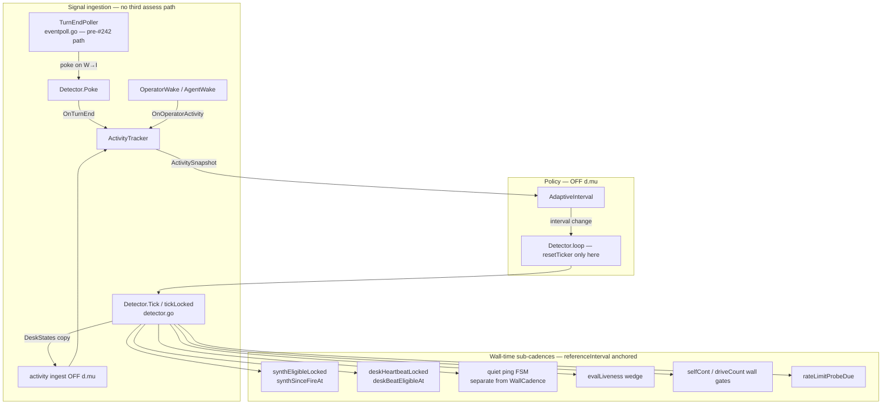

# Adaptive Detector Cadence

| Field | Value |
|-------|-------|
| **Author** | (TBD) |
| **Date** | 2026-07-02 |
| **Status** | Draft — pending COS gate |
| **Supersedes** | Static `--interval` knob from PR #242 (`coordination-latency`) as the durable latency answer |
| **Depends on** | `coordination-latency` (#242) **merged** (`6135f0b8`) and **deployed** (`FLOTILLA_WATCH_INTERVAL=10m`, `FLOTILLA_EVENT_POLL_INTERVAL=5s`; event-pokes verified live) |

---

## Overview

The change-detector in `internal/watch/detector.go` drives fleet coordination on a **fixed** `time.NewTicker(cfg.Interval)` (roster `heartbeat_interval`, typically 20m). PR #242 (`coordination-latency`) — **merged and deployed** — adds event-driven `TurnEndPoller` pokes so desk `Working→Idle` transitions reach the clock XO in ~8s (5s poll + 3s debounce) without shortening the periodic tick. That is the right interim fix; this design **supersedes the static interval override** with an **adaptive tick cadence** that speeds up while turn progress is active and relaxes toward a ceiling when the fleet is idle.

The adaptive clock must not introduce a **third** pane-assess path. It consumes observations from the **existing** periodic tick assess and #242 poller poke events. Critically, several sub-cadences today count **ticks** tied to `cfg.Interval` (synthesis digest, desk heartbeats, quiet ping, liveness wedge, plus XO self-cont, backlog stuck cap, rate-limit probes). If the tick interval shrinks without decoupling those counters, liveness false-alarms, wake storms, and operator-visible cap/probe acceleration follow. This design decouples all coupled cadences to **wall time** anchored on `referenceInterval` first, then layers the adaptive policy.

**Latency targets (operator-perceived):**

| Scenario | Target | Mechanism |
|----------|--------|-----------|
| Desk finishes turn, poller enabled (#242) | ≤ 8s to clock XO poke-tick | `TurnEndPoller` unchanged; adaptive is additive |
| Desk finishes, poller disabled | ≤ adaptive floor (default 2m) | Faster periodic tick under activity |
| All-idle fleet | ceiling tick (default roster 20m) | Slow assess cadence, $0-idle preserved |
| Wedged XO alert | unchanged semantics | `alertWindow` wall-time, independent of live tick |

**Assess I/O (tmux, not LLM tokens):** two independent assess paths exist today (#242). **N** = non-XO monitored desk count; tick also assesses the XO (+1). Poller **skips** the XO (`eventpoll.go:105–107`).

| Source | Rate | Example N=8 non-XO |
|--------|------|-------------------|
| **TurnEndPoller** (default 5s) | `N × (3600/pollSec)/hr` — non-XO desks only | 8 × 720 = **5,760/hr** |
| **Periodic tick at adaptive floor** (2m) | `(N+1) × 30/hr` — all `cfg.Desks` incl. XO | 9 × 30 = **270/hr** |
| **Periodic tick at ceiling** (20m) | `(N+1) × 3/hr` | 9 × 3 = **27/hr** |

Adaptive floor **adds** tick assesses on top of the poller baseline; poller is the dominant tmux I/O cost. XO LLM wakes remain event-gated (material diff, pokes, liveness); faster ticks alone do not multiply XO turns.

---

## Background & Motivation

### The 20m fixed clock

`Detector.loop()` (`detector.go:519–557`) uses a single `time.NewTicker(d.cfg.Interval)`. Every tick runs `tickLocked`, which calls `cfg.Assess(agent)` for every desk (`detector.go:803–805`). Coordination latency for non-poked paths is **O(interval)**:

- `externalMaterial` only runs on tick boundaries.
- Desk heartbeats accrue `deskSinceBeat` per tick (`detector.go:991`).
- Synthesis digest accrues `synthSinceFire` per tick (`detector.go:1051–1052`).
- Quiet ping accrues `quietTicks` per tick (`detector.go:906–909`).
- AckAge wedge multiplies tick-count by live interval (`detector.go:1318`):

```go
case shellStreak == 0 && d.cfg.AckAge() > time.Duration(d.alertInterval)*d.cfg.Interval:
```

### PR #242 interim (`coordination-latency`) — merged + deployed

Implemented in-tree. Adds:

- `Detector.Poke()` + debounced extra `Tick()` on `pokeCh` (`detector.go:510–557`).
- `TurnEndPoller` fast poll (`eventpoll.go`) — reuses injected `Assess`, calls `poke()` on non-XO `Working→Idle`.
- `--interval` / `FLOTILLA_WATCH_INTERVAL` static override (`cmd/flotilla/watch.go:101–142`).

**Non-goal of #242:** replacing the periodic tick or fixing tick-coupled sub-cadences. Adaptive cadence is the durable follow-on.

### The P0 trap: coupled cadences

All rows below use **K=3** (default `max-missed-acks`) and **referenceInterval = 20m** unless noted. Mode-specific quiet-ping math verified against `livenessParams` (`detector.go:470–497`) and `TestLivenessParams` (`detector_test.go:558–580`).

| Sub-cadence | Current coupling | Reference semantics (20m) | Failure if live interval → 2m (unmigrated) |
|-------------|------------------|-------------------------|-----------------------------------------------|
| **AckAge wedge** | `alertInterval × cfg.Interval` (`detector.go:1318`) | **`none` (default):** 7 intervals = **140m**; `interval` mode: 3 intervals = **60m** | **`none`:** 7×2m = **14m** → **P0 false wedged alerts** |
| **Max-quiet ping** | `quietTicks >= pingEvery` (`detector.go:906–909`) | **`none`:** `pingEvery=2K=6` → **120m**; **`interval`:** `K-1=2` → **40m** | **`none`:** 6×2m = **12m** (not 4–6m); **`interval`:** 2×2m = **4m** → ping storm |
| **Synthesis digest** | `SynthEveryTicks=3`, per-tick `synthSinceFire++` (`synthesis.go:18`, `detector.go:1051–1052`, `1079`) | 3×20m = **60m** between fires | 3×2m = **6m** → **P1 synthesis wake storm** |
| **Desk heartbeat** | `DeskHeartbeatEveryTicks=1`, `deskSinceBeat++` (`watch.go:606`, `detector.go:991`) | 1×20m = **20m** between beats | 1×2m = **2m** → **P1 desk wake storm** |
| **XO self-continuation cap** | `selfCont++` per continuation tick (`detector.go:1234–1238`) | Cap after N continuations over **N × referenceInterval** wall time | Cap in **N × 2m** → faster settle-forcing (**P1**) |
| **Backlog stuck cap** | `driveCount[target]++` per backlog wake (`detector.go:1248–1254`) | Escalate after `BacklogStuckCap` drives over **cap × referenceInterval** | Escalate in **cap × 2m** → faster stuck alerts (**P1**) |
| **Rate-limit probes** | `rateLimitWorkLocked` probes Idle/Errored desks **every tick** (`detector.go:1435–1457`) | Probe cadence = **referenceInterval** | Probe every **2m** → multiplied tmux probe I/O (**P2**) |

**Severity summary:** AckAge wedge = **P0**. Synthesis/desk/self-cont/backlog storms = **P1**. Assess/probe I/O at floor = **P2**.

**PR 1 decision:** migrate **all rows** to wall-time periods anchored on `referenceInterval` (see §Coupled Cadences). No accepted semantic drift at 2m live tick.

---

## Goals & Non-Goals

### Goals

1. **Adaptive tick interval** — faster under active turn progress, slower when idle; env-tunable floor/ceiling.
2. **No third assess path** — activity consumes periodic tick assess snapshots + existing #242 poller poke events only; `ActivityTracker` performs no pane I/O.
3. **Wall-time sub-cadences** — all P0-table cadences independent of live tick rate, anchored on `referenceInterval`.
4. **Attack/release asymmetry** — tighten fast on activity; decay slow; hysteresis prevents oscillation.
5. **Scoped backward compatibility** — adaptive OFF **and** live `cfg.Interval == referenceInterval` (default roster ceiling) ⇒ sub-cadence semantics byte-identical to pre-adaptive at 20m. Static `--interval` override without adaptive changes **coordination latency only** after PR 1; sub-cadence periods follow `referenceInterval`, not the override.
6. **Quantified cost bounds** — document tick + poller assess rates; tunable floor caps incremental tick cost.

### Non-Goals

- Sub-second global tick (TurnEndPoller retains that role).
- Replacing `TurnEndPoller` when enabled.
- Per-agent adaptive intervals (fleet-wide clock only).
- Roster-schema changes (all tuning via CLI/env).
- Adaptive `EventPollInterval` (poller stays 5s default).

---

## Proposed Design

### Architecture



### (1) SIGNAL — what "turn progress" means

Activity is derived from **observations already made** by the tick and poller:

| Signal | Source | Weight | Rationale |
|--------|--------|--------|-----------|
| **Any non-XO desk `StateWorking`** | tick assess snapshot | **Active** | Work in flight below the XO (includes project-XOs, CoS — all monitored desks in `Desks`) |
| **XO `StateWorking`** | same snapshot | **Active** | Clock mid-turn / gate cycle |
| **`XOSettled == false`** | detector snapshot | **Active** | Open coordination cycle (XO not idle-signaled) |
| **Turn-end poke** (W→I) | `TurnEndPoller` → `Poke()` hook | **Warm** (time-bounded) | Recent exchange completed; may be between active desks |
| **Turn-end from tick diff** | W→I in `tickLocked` mirror path (`detector.go:834`) | **Warm** | Same signal when poller disabled or race |
| **Operator wake** | `OperatorWake` / `AgentWake` | **Warm** (short window) | Operator present; bias toward responsiveness |
| **All desks idle + XO settled + no warm window** | derived | **Idle** | True $0-idle fleet |

**Rejected as primary signals:**

- **Separate pane polling for activity** — would be a third assess path.
- **Signal-file hash** — external, not turn-progress; still wakes material on tick, does not drive cadence.
- **Backlog gate contents** — XO output; file I/O; not turn-progress.

**CoS / federated sub-XOs (open Q4 → resolved K12):** coordinators are ordinary monitored desks in `Desks`; `StateWorking` on a project-XO or CoS already elevates to **Active** via the working-desks rule. No separate `IsCoordinator` signal needed.

#### `ActivityTracker` interface sketch

New file: `internal/watch/activity.go`

```go
package watch

import (
    "time"
    "github.com/jim80net/flotilla/internal/surface"
)

type ActivityLevel int

const (
    ActivityIdle ActivityLevel = iota
    ActivityWarm
    ActivityActive
)

type ActivitySnapshot struct {
    Level          ActivityLevel
    WorkingDesks   int
    XOWorking      bool
    XOSettled      bool
    LastTurnEnd    time.Time
    LastOperatorAt time.Time
    ObservedAt     time.Time
}

// ActivityTracker ingests detector observations. NO pane I/O.
type ActivityTracker interface {
    // OnTickIngest: pure; called OFF d.mu with a copy of debounced DeskStates.
    OnTickIngest(observedAt time.Time, xoAgent string, states map[string]surface.State, xoSettled bool)
    OnTurnEnd(agent string, at time.Time)       // poller poke + tick-diff W→I
    OnOperatorActivity(at time.Time)
    Snapshot(now time.Time) ActivitySnapshot
}
```

#### Ingestion wiring (OFF `d.mu`)

Mirror the two-phase pattern used by `deskWarrantSnapshot` / `deskHeartbeatLocked` (`detector.go:922–933`):

1. **`Tick()`** — after `tickLocked` returns, copy `snap.DeskStates` under a brief lock (or return snapshot from `tickLocked`), then call `activity.OnTickIngest(now, …)` **OFF** `d.mu`.
2. **`AdaptiveInterval.Update(snapshot)`** — also OFF `d.mu`, in `Tick()` tail or `loop()` after `Tick()` completes. Never under `tickLocked`.
3. **Dynamic ticker reset** — `loop()` goroutine only (see §Dynamic ticker concurrency).
4. **`TurnEndPoller`** — `watch.go` wiring: `onPoke := func() { activity.OnTurnEnd("", time.Now()); det.Poke() }`. Agent name optional (PR 2); Warm window extension is idempotent.
5. **Tick-diff W→I** — in `tickLocked` at `detector.go:834`, record pending turn-end agents; `Tick()` tail calls `OnTurnEnd(name, now)` for each (dedupe with poller poke is fine).

**Constraint satisfied:** no third assess path; `ActivityTracker` consumes tick assess output + existing poller poke events only.

### (2) POLICY — floor, ceiling, attack/release, hysteresis

New file: `internal/watch/adaptive_interval.go`

```go
type AdaptiveConfig struct {
    Enabled           bool
    Floor             time.Duration // default 2m
    Ceiling           time.Duration // default roster heartbeat_interval
    Warm              time.Duration // default 8m
    WarmRetention     time.Duration // default 10m
    OperatorRetention time.Duration // default 5m
    ReleaseStepEvery  time.Duration // default 5m
    IdleStableFor     time.Duration // default 10m
}

type AdaptiveInterval interface {
    Current() time.Duration
    Update(snap ActivitySnapshot) (interval time.Duration, changed bool)
}
```

#### Default tier mapping

| `ActivityLevel` | Target interval | Notes |
|-----------------|-----------------|-------|
| `ActivityActive` | **Floor** (2m) | Any working desk, XO working, or XO unsettled |
| `ActivityWarm` | **Warm** (8m) | Recent turn-end or operator within retention; no Active |
| `ActivityIdle` | **Ceiling** (20m) | All idle, XO settled, warm windows expired |

#### Attack / release asymmetry

- **Attack:** `Active` ⇒ `Floor` immediately.
- **Release:** `Floor → Warm → Ceiling`, at most one step per `ReleaseStepEvery` (5m).
- **Hysteresis:** `Ceiling` only after `ActivityIdle` sustained `IdleStableFor` (10m).

#### Env / CLI tuning

| Flag | Env | Default | Role |
|------|-----|---------|------|
| `--adaptive-interval` | `FLOTILLA_ADAPTIVE_INTERVAL` | `true` at GA (canary `false` first — K12) | Master enable |
| `--interval-floor` | `FLOTILLA_INTERVAL_FLOOR` | `2m` | Active-tier tick |
| `--interval-warm` | `FLOTILLA_INTERVAL_WARM` | `8m` | Post-turn-end tier |
| `--interval` | `FLOTILLA_WATCH_INTERVAL` | roster `heartbeat_interval` | **Ceiling** when adaptive ON |
| `--interval-idle-stable` | `FLOTILLA_INTERVAL_IDLE_STABLE` | `10m` | Hysteresis before ceiling |
| `--interval-release-step` | `FLOTILLA_INTERVAL_RELEASE_STEP` | `5m` | Decay cadence between tiers |

**Relationship to #242 `--interval`:** when `FLOTILLA_ADAPTIVE_INTERVAL=0`, `--interval` sets fixed tick (post-#242). When adaptive ON, `--interval` sets **ceiling only**.

#### Dynamic ticker concurrency

All timer/ticker mutations occur **only** in the `loop()` goroutine (`detector.go:519–557`). No ticker reset from `tickLocked`, `Tick()` tail, or `AdaptiveInterval` directly.

```go
// loop() sketch — single owner goroutine
func (d *Detector) loop() {
    interval := d.currentInterval() // from AdaptiveInterval or cfg.Interval
    ticker := time.NewTicker(interval)
    defer ticker.Stop()
    var debounce *time.Timer
    var debounceC <-chan time.Time

    for {
        select {
        case <-d.stop:
            return
        case newInterval := <-d.intervalCh: // buffered size 1; coalesced
            drainTicker(ticker)
            ticker.Stop()
            ticker = time.NewTicker(newInterval)
        case <-ticker.C:
            d.Tick()
            // After Tick(), read policy snapshot; if interval changed, non-blocking send to intervalCh
            d.maybeQueueIntervalUpdate()
        case <-d.pokeCh:
            resetDebounce(&debounce, &debounceC, d.pokeDebounce)
        case <-debounceC:
            debounceC = nil
            d.Tick()
            d.maybeQueueIntervalUpdate()
        }
    }
}
```

**Rules:**

| Rule | Rationale |
|------|-----------|
| `intervalCh` buffered (1), coalesced | Avoid blocking `Tick()` tail; latest interval wins |
| `drainTicker` before `Stop`/`Reset` | Same discipline as poke debounce drain (`detector.go:531–535`); no spurious tick after shrink |
| Poke debounce and interval change are independent | A poke during shrink runs at most one debounced `Tick()`; interval change does not flush debounce |
| `maybeQueueIntervalUpdate` OFF `d.mu` | Reads `AdaptiveInterval.Current()` after activity ingest in `Tick()` tail |
| Integration test | Poke during interval shrink/expand ⇒ exactly one assess per completed `Tick()`; no double-`Tick()`, no skipped cold-start path |

### (3) COUPLED CADENCES — wall-time decoupling

#### Reference interval

```
referenceInterval = cfg.CeilingInterval // roster HeartbeatDur() unless --interval raises ceiling only
```

Sub-cadence **periods** derive from `referenceInterval`, **not** live adaptive tick. Live `cfg.Interval` affects only how often the tick loop runs (coordination latency, assess rate).

#### `WallCadence` — synthesis (and similar) only

New file: `internal/watch/wall_cadence.go`

```go
// WallCadence — for synthesis-style "eligible immediately if never fired" semantics ONLY.
type WallCadence struct {
    Period   time.Duration
    lastFire time.Time
    now      func() time.Time
}

func (c *WallCadence) Due() bool {
    if c.Period <= 0 { return false }
    if c.lastFire.IsZero() { return true } // never fired → eligible (synthesis owe)
    return c.now().Sub(c.lastFire) >= c.Period
}
```

**Do not use `WallCadence` for quiet ping** — semantics differ (see below).

#### Migrations per sub-cadence (complete P0 table)

| Sub-cadence | Wall-time replacement | Anchor |
|-------------|----------------------|--------|
| **AckAge wedge** | `d.alertWindow time.Duration`; `AckAge() > alertWindow` | `livenessParamsWall(mode, K, referenceInterval)` |
| **Quiet ping** | `quietPingFSM` (separate state machine) | `pingPeriod` from `livenessParamsWall` |
| **Synthesis digest** | `synthSinceFireAt map[string]time.Time` — **set only on fire** | `SynthEveryPeriod = 3 × referenceInterval` |
| **Desk heartbeat** | `deskBeatEligibleAt map[string]time.Time` | `DeskHeartbeatPeriod = referenceInterval` |
| **XO self-cont cap** | `selfCont` increments only when `selfContDue()` (≥ `referenceInterval` since last continuation wake) | `referenceInterval` |
| **Backlog stuck cap** | `driveCount` increments only when `backlogDriveDue(item)` (≥ `referenceInterval` since last drive of that item) | `referenceInterval` |
| **Rate-limit probes** | `rateLimitProbeDue()` — probe Idle/Errored desks at most once per `RateLimitProbePeriod` | `RateLimitProbePeriod = referenceInterval` |

**`livenessParamsWall`** (`detector.go`):

```go
func livenessParamsWall(mode string, k int, ref time.Duration, nOverride time.Duration) (pingPeriod, alertWindow time.Duration) {
    pingTicks, alertTicks := livenessParams(mode, k, 0)
    pingPeriod = time.Duration(pingTicks) * ref
    alertWindow = time.Duration(alertTicks) * ref
    if nOverride > 0 {
        pingPeriod = nOverride
    }
    return
}
```

**Mode-specific reference periods (K=3, ref=20m):**

| Mode | `pingPeriod` | `alertWindow` |
|------|--------------|---------------|
| **`none` (default)** | 6 × 20m = **120m** | 7 × 20m = **140m** |
| **`interval`** | 2 × 20m = **40m** | 3 × 20m = **60m** |
| **`consecutive`** | 2 × 20m = **40m** | 4 × 20m = **80m** |

At 2m live tick with wall-time migration, these periods are **unchanged** — only assess frequency changes.

#### Quiet ping — separate state machine (not `WallCadence`)

Today (`detector.go:901–910`, `818`): cold start sets `quietTicks = 0` and returns early (no ping); first **quiet** tick sets `quietTicks = 1`; ping when `quietTicks >= pingEvery`; any wake resets counter.

```go
// quietPingFSM — distinct semantics; zero time means "clock not started", NOT "due immediately".
type quietPingFSM struct {
    pingPeriod time.Duration
    quietSince time.Time // zero = not accumulating quiet time yet
    running    bool     // false during cold-start tick and whenever woke==true
}

func (q *quietPingFSM) OnWake(now time.Time) {
    q.quietSince = time.Time{} // stop clock
}

func (q *quietPingFSM) OnColdStart() {
    q.quietSince = time.Time{}
}

func (q *quietPingFSM) OnQuietTick(now time.Time) (fire bool) {
    if q.quietSince.IsZero() {
        q.quietSince = now // anchor on FIRST quiet tick — equivalent to quietTicks=1
        return false
    }
    return now.Sub(q.quietSince) >= q.pingPeriod
}

func (q *quietPingFSM) OnPingFired(now time.Time) {
    q.quietSince = now // re-anchor after ping
}
```

**Regression target:** port `TestDetectorMaxQuietPing` (`detector_test.go:498`) — no ping on cold start; no ping until `pingPeriod` of quiet time at 20m reference; same at 2m live tick.

#### Synthesis digest — `synthSinceFireAt` only on fire

**Remove** per-tick increment (`detector.go:1051–1052`). Timestamps updated **only** in `commitSynthesisLocked` on fire (`detector.go:1149` equivalent):

```go
// synthEligibleLocked — no global increment loop
for _, agent := range order {
    if !d.synthOwed[agent] { continue }
    if ts, ok := d.synthSinceFireAt[agent]; ok && d.now().Sub(ts) < d.cfg.SynthEveryPeriod {
        continue // fired recently; owe kept for coalescing
    }
    out = append(out, synthEligible{...})
}

// commitSynthesisLocked on fire:
d.synthSinceFireAt[agent] = d.now()
```

Never-fired agents (no map entry) remain immediately eligible (`detector.go:1077–1078`). Long idle gap with retained owe: elapsed ≥ `SynthEveryPeriod` ⇒ eligible on next tick.

#### Desk heartbeat — wall-time + judgment cadence-neutral

Full `deskHeartbeatLocked` switch migration (Working + Idle paths):

```go
switch cur.DeskStates[name] {
case surface.StateWorking:
    // Progress: restart cadence + cap — equivalent to deskSinceBeat[name]=0 (detector.go:973–981)
    d.deskProgressed[name] = true
    delete(d.deskStopped, name)
    d.deskNoProgress[name] = 0
    delete(d.deskBeatEligibleAt, name) // cadence restart; beat not owed while Working
    delete(d.deskSettled, name)
case surface.StateIdle:
    if d.deskSettled[name] || d.deskStopped[name] { continue }

    // #189 not-warranted: cadence-neutral — freeze elapsed, do NOT re-anchor to now
    if w, ok := warrant[name]; ok && !w {
        delete(d.deskBeatEligibleAt, name) // equivalent to deskSinceBeat=0 freeze
        continue                           // cap-neutral unchanged
    }

    last := d.deskBeatEligibleAt[name]
    if !last.IsZero() && d.now().Sub(last) < d.cfg.DeskHeartbeatPeriod {
        continue // cadence not elapsed
    }
    // owed beat → fire; on fire: d.deskBeatEligibleAt[name] = d.now()
    // ... cap accounting unchanged ...
}
```

Preserves `detector.go:1007–1009` judgment semantics and `973–981` Working-branch cadence restart. Extend `detector_heartbeat_judgment_test.go` at 2m live tick / 20m `DeskHeartbeatPeriod`, including beat **not** owed immediately after Working→Idle transition.

#### `continueXO` — integrated wall-time gates (rotate-on-settle preserved)

Verified against `detector.go:1205–1257`: today `requestRotate()` runs **unconditionally first** when not `Awaiting` (lines 1211–1213), **before** `SettleConsume` and the empty-backlog branch. A settling tick therefore **still rotates** — fresh context on idle is a deliberate property (XO idles clean; next wake starts fresh). PR 1 MUST preserve this.

Wall gates apply only to **continuation** and **backlog-drive** wakes/counters — not to the settle path. When `!continuationDue()` or `!backlogDriveDue()`, return **without** rotate or wake (fixes the 2m rotate storm while wakes are wall-gated). The settle path keeps today's rotate-then-settle ordering.

**Awaiting veto (unchanged):** `requestRotate` suppressed only while `Awaiting()` is true.

```go
func (d *Detector) continueXO(cur *Snapshot, wake func(WakeKind, []string), requestRotate func()) {
    settleSignalled := d.cfg.SettleConsume != nil && d.cfg.SettleConsume()

    queue := d.cfg.BacklogGate().Unblocked
    if d.cfg.Awaiting != nil && d.cfg.Awaiting() {
        queue = nil // operator-gated pause — unchanged
    }
    d.pruneDriveCounts(queue)

    if len(queue) == 0 {
        // --- empty backlog ---
        if settleSignalled {
            // Rotate-on-settle preserved (today: rotate already ran at top; here we
            // rotate explicitly before marking settled so semantics stay byte-identical).
            if d.cfg.Awaiting == nil || !d.cfg.Awaiting() {
                requestRotate()
            }
            cur.XOSettled = true
            return
        }
        if !d.continuationDue() { // lastContinuationAt + ReferenceInterval
            return // no rotate, no wake, no selfCont++ — wall-gated
        }
        if d.cfg.Awaiting == nil || !d.cfg.Awaiting() {
            requestRotate()
        }
        d.selfCont++
        d.lastContinuationAt = d.now()
        if d.selfCont > d.cfg.MaxSelfContinuation {
            cur.XOSettled = true
            return
        }
        wake(WakeContinuation, nil)
        return
    }

    // --- backlog drive path ---
    d.selfCont = 0
    target := d.pickDriveTarget(queue)
    if !d.backlogDriveDue(target) { // lastDriveAt[target] + ReferenceInterval
        return // no rotate, no wake, no driveCount++ — wall-gated
    }
    if d.cfg.Awaiting == nil || !d.cfg.Awaiting() {
        requestRotate()
    }
    d.driveCount[target]++
    d.lastDriveAt[target] = d.now()
    if d.driveCount[target] == d.cfg.BacklogStuckCap {
        // stuck escalation — unchanged
    }
    wake(WakeBacklog, []string{target})
}

func (d *Detector) continuationDue() bool {
    return d.lastContinuationAt.IsZero() ||
        d.now().Sub(d.lastContinuationAt) >= d.cfg.ReferenceInterval
}

func (d *Detector) backlogDriveDue(item string) bool {
    t, ok := d.lastDriveAt[item]
    return !ok || d.now().Sub(t) >= d.cfg.ReferenceInterval
}
```

PR 1 tests:
- **Continuation path:** at 2m live tick, repeated XO `Working→Idle` with empty backlog and no settle signal must call `requestRotate` at most once per `referenceInterval`.
- **Settle path:** XO `Working→Idle` with settle marker consumed must still call `requestRotate` (unless `Awaiting`) even when `!continuationDue()` — byte-identical to today.

#### Rate-limit probes — wall-time gate

```go
// rateLimitWorkLocked: append to work.probe only if rateLimitProbeDue(name)
// rateLimitLastProbeAt[name] + RateLimitProbePeriod <= now
```

`runRateLimitProbes` unchanged; fewer probe batches at 2m live tick.

#### Wake reset table (external + tick-path)

Wall-time fields must mirror today's counter resets on operator re-engage and tick wakes (`detector.go:567–573`, `597`, `903–904`):

| Trigger | Today | After PR 1 |
|---------|-------|------------|
| **`OperatorWake`** (`detector.go:563–580`) | `quietTicks=0`, `selfCont=0`, `driveCount` cleared | `quietFSM.OnWake(now)`; `selfCont=0`; `lastContinuationAt` zeroed; `lastDriveAt` cleared; `driveCount` cleared |
| **`AgentWake`** (`detector.go:589–603`) | `delete(deskSinceBeat[agent])` + settle/stop/cap | `delete(deskBeatEligibleAt[agent])` + existing settle/stop/cap/progressed resets |
| **`tickLocked` `woke==true`** (`detector.go:903–904`) | `quietTicks=0` | `quietFSM.OnWake(now)` — covers material, continuation, backlog, ping, synthesis-scheduled paths that set `woke` |
| **Cold start** (`detector.go:818`) | `quietTicks=0` (early return) | `quietFSM.OnColdStart()` |

`OperatorWake` clearing `lastContinuationAt` ensures operator re-engage is not suppressed by a recent wall clock. `AgentWake` clearing `deskBeatEligibleAt` matches today's `deskSinceBeat` delete so re-engaged desks get a fresh heartbeat cadence.

#### `DetectorConfig` additions

```go
type DetectorConfig struct {
    ReferenceInterval      time.Duration
    SynthEveryPeriod       time.Duration
    DeskHeartbeatPeriod    time.Duration
    PingPeriod             time.Duration
    AlertWindow            time.Duration
    RateLimitProbePeriod   time.Duration
    Activity               ActivityTracker
    AdaptiveInterval       AdaptiveInterval
}
```

### (4) TOKEN / WAKE COST

#### Combined assess I/O

**N** = non-XO desk count. Poller assesses **N** agents; tick assesses **N+1** (includes XO).

| Component | Formula | N=8 non-XO, 5s poll, 2m floor |
|-----------|---------|-------------------------------|
| TurnEndPoller | `N × (3600/pollSec)` | 8 × 720 = **5,760/hr** |
| Tick @ floor 2m | `(N+1) × 30` | 9 × 30 = **270/hr** |
| Tick @ ceiling 20m | `(N+1) × 3` | 9 × 3 = **27/hr** |
| **Total @ floor** | poller + tick | **6,030/hr** |
| **Total @ ceiling** | poller + tick | **5,787/hr** |

Poller dominates; adaptive floor adds **~4%** incremental assess at N=8 (270/5787). Incremental share rises for larger N and slower poll intervals.

#### LLM / XO wake rate at floor

Periodic ticks **do not** wake the XO unless `tickLocked` finds material work. At 2m live tick with wall-time migration:

| Wake kind | Period (default `none`, K=3, ref=20m) |
|-----------|---------------------------------------|
| Desk heartbeats | **20m** per idle desk |
| Synthesis | **60m** per owed agent |
| Quiet ping | **120m** (`2K × referenceInterval`) |
| AckAge wedge | **140m** |
| Material | event-driven (poller ~8s when enabled) |

**`interval` mode** (not default): quiet ping **40m**, wedge **60m**.

---

## API / Interface Changes

### `internal/watch`

| Symbol | Change |
|--------|--------|
| `DetectorConfig` | `ReferenceInterval`, wall periods, `RateLimitProbePeriod`, optional `Activity`, `AdaptiveInterval` |
| `Detector.loop` | `intervalCh`, `resetTicker`, `maybeQueueIntervalUpdate` |
| `Detector.Tick` | Activity ingest + policy update OFF `d.mu` |
| `NewDetector` | `livenessParamsWall`; wall periods from `referenceInterval` |
| `evalLiveness` | `d.alertWindow` |
| `synthEligibleLocked` | `synthSinceFireAt`; no per-tick increment |
| `deskHeartbeatLocked` | `deskBeatEligibleAt`; Working-branch delete; judgment cadence-neutral branch |
| `continueXO` | Wall-gated continuation/backlog; rotate-on-settle preserved |
| `OperatorWake` / `AgentWake` | Wake reset table for wall-time fields |
| `tickLocked` | `quietPingFSM`; wall-gated `continueXO`/probe |
| `activity.go`, `adaptive_interval.go`, `wall_cadence.go`, `quiet_ping.go` | **New** |

### `cmd/flotilla/watch.go`

- Parse adaptive flags; wire `ReferenceInterval`, activity, adaptive.
- Poke wrapper for `OnTurnEnd`.
- Startup log: assess rates + `interval=adaptive floor=… ceiling=…`.

### `internal/dash/readmodel.go` (PR 4)

- `FreshnessThreshold = 3 × referenceInterval` (ceiling), **not** live adaptive interval (K9).

### `deploy/flotilla-watch-install.sh`

- Env keys for adaptive tuning.

---

## Data Model Changes

**None durable.** Activity/adaptive state in-memory only. Restart → ceiling cold-start (conservative).

---

## Alternatives Considered

### Alternative A: Static `--interval` only (PR #242)

**Rejected** as durable answer; `ADAPTIVE_INTERVAL=0` fallback. After PR 1, static 5m override improves latency but sub-cadences stay at 20m reference (K11).

### Alternative B: Poll-only / kill periodic tick

**Rejected** — loses signal-file, backlog, rate-limit, synthesis owed aging.

### Alternative C: Per-subsystem timers (no adaptive tick)

**Rejected** — operator directive targets the clock.

### Alternative D: Activity from Discord relay presence

**Partially adopted** — Warm window only.

### Alternative E: Leave selfCont/backlog/probes tick-coupled

**Rejected** — operator-visible semantic drift at 2m floor; included in PR 1 (K10).

---

## Security & Privacy Considerations

- No new I/O surfaces for activity.
- Assess frequency: poller baseline + incremental tick cost at floor.
- Ticker reset per §Dynamic ticker concurrency — drain before stop; loop goroutine sole owner.

---

## Observability

### Structured log lines

```
flotilla watch: adaptive-interval 20m -> 2m reason=active working_desks=3 xo_settled=false
flotilla watch: assess-rate tick=270/hr poller=5760/hr desks_non_xo=8 desks_tick=9
```

### Dash banner (`internal/dash/readmodel.go`)

**Resolved (K9):** `FreshnessThreshold = 3 × referenceInterval` (roster ceiling). Healthy watch at 2m floor writes snapshots every ~2m; stale banner fires when watch is dead **~60m** (3×20m), not 6m. Wiring in PR 4; documented in PR 5.

---

## Rollout Plan

1. **#242** — merged (`6135f0b8`) + deployed (`10m`/`5s`) ✅
2. **PR 1 (P0):** Wall-time sub-cadences only, adaptive OFF.
3. **PR 2:** `ActivityTracker` ingest OFF `d.mu`.
4. **PR 3:** `AdaptiveInterval` + dynamic `loop()`.
5. **PR 4:** CLI/env/deploy + dash `FreshnessThreshold` wiring.
6. **Canary (48h):** `FLOTILLA_ADAPTIVE_INTERVAL=true`, `FLOOR=5m`; monitor assess CPU + false alerts.
7. **GA:** default `FLOTILLA_ADAPTIVE_INTERVAL=true`, floor 2m (K12).

**Rollback:** `FLOTILLA_ADAPTIVE_INTERVAL=0`.

---

## Open Questions

1. **Warm tier default (8m)** — defer; sqrt(floor×ceiling) alternative documented if ops feedback says 8m insufficient.
2. **Turn-end dedupe** — **resolved:** idempotent Warm extension; both poller poke and tick-diff W→I call `OnTurnEnd`.
3. **Persist adaptive tier across restart?** — **defer** out of scope; ceiling cold-start is conservative.
4. **CoS / federated sub-XOs** — **resolved (K12):** covered by desk `StateWorking` in assess snapshot.
5. **Dash stale threshold** — **resolved (K9):** `3 × referenceInterval`.

---

## References

- `internal/watch/detector.go` — `loop`, `tickLocked`, `evalLiveness`, `synthEligibleLocked`, `deskHeartbeatLocked`, `continueXO`, `rateLimitWorkLocked`
- `internal/watch/eventpoll.go` — `TurnEndPoller`
- `internal/watch/detector_test.go` — `TestLivenessParams`, `TestDetectorMaxQuietPing`
- `internal/dash/readmodel.go` — `FreshnessThreshold`
- `cmd/flotilla/watch.go` — wiring
- `openspec/changes/coordination-latency/` — #242 (landed, COS pending)

---

## Key Decisions

| # | Decision | Rationale |
|---|----------|-----------|
| K1 | **Wall-time decoupling ships before adaptive policy** | P0 false wedge at 2m breaks trust |
| K2 | **`referenceInterval` = ceiling/roster value, not live tick** | Preserves 20m-tuned semantics |
| K3 | **No third assess path** — activity consumes tick assess output + existing #242 poller poke events only; `ActivityTracker` does no pane I/O; tick-diff W→I (`detector.go:834`) also feeds `OnTurnEnd` | Correctly scopes "no new observer" beyond pre-existing poller + tick |
| K4 | **Three-tier policy with asymmetric attack/release** | Prevents thrash; env-tunable |
| K5 | **`--interval` = ceiling when adaptive ON** | #242 env back-compat |
| K6 | **`TurnEndPoller` independent of adaptive floor** | Sub-floor latency ~8s |
| K7 | **Default floor = 2m** | Operator directive; incremental tick cost small vs poller |
| K8 | **In-memory activity state only** | Conservative restart |
| K9 | **Dash `FreshnessThreshold = 3 × referenceInterval`** | Avoid false STALE at 2m floor; still detect dead watch at ~60m for 20m roster |
| K10 | **selfCont, BacklogStuckCap, rate-limit probes, and `continueXO` continuation/backlog wall-gated on `referenceInterval` in PR 1** | `return` without rotate/wake when not due; **rotate-on-settle preserved** (explicit rotate before `XOSettled`, gated only on `Awaiting`) |
| K11 | **Backward compat scoped:** adaptive OFF + live interval == referenceInterval ⇒ sub-cadence byte-identical; static `--interval` override changes latency only post-PR1 | Honest compat claim |
| K12 | **CoS/coordinator Working → Active via standard desk assess; GA default `FLOTILLA_ADAPTIVE_INTERVAL=true` after 48h canary** | Resolves federated meta-clock + rollout stance |

---

## PR Plan

| Order | Title | Files (primary) | Deps | Description |
|-------|-------|-----------------|------|-------------|
| **PR 1** | `watch: decouple sub-cadences to wall time` | `detector.go`, `wall_cadence.go`, `quiet_ping.go`, `*_test.go` | #242 ✅ | Full P0 table migration |
| **PR 2** | `watch: activity tracker signal ingestion` | `activity.go`, `detector.go`, `watch.go` | PR 1 | OFF `d.mu` ingest |
| **PR 3** | `watch: adaptive interval policy engine` | `adaptive_interval.go`, `detector.go` | PR 2 | Dynamic `loop()` + concurrency |
| **PR 4** | `cmd/watch: adaptive interval CLI and env` | `watch.go`, `readmodel.go`, `deploy/*` | PR 3 | Flags + dash threshold |
| **PR 5** | `docs/openspec: adaptive detector cadence` | `openspec/…`, `docs/watch-runbook.md` | PR 4 | Spec + migration guide |

### PR 1 acceptance criteria (explicit test matrix)

| Test | File | What it proves |
|------|------|----------------|
| `TestLivenessParams` + new `TestLivenessParamsWall` | `detector_test.go` | `none`/`interval`/`consecutive` periods at referenceInterval; K=3 `none` → 120m ping / 140m alert |
| `TestDetectorMaxQuietPing` (ported) | `detector_test.go` | Cold start no ping; first quiet tick anchors; fire at `pingPeriod`; reset on wake; **2m live tick + 120m period** |
| `TestDetectorAckAgeWedge` (new/extended) | `detector_test.go` | No false wedge at 2m live tick when `AckAge` < 140m (`none`/K=3) |
| `detector_synthesis_test.go` | existing + new case | 2m live tick, `SynthEveryPeriod=60m`: no fire before 60m; immediate eligibility when never-fired; owe coalescing after fire |
| `detector_heartbeat_*_test.go` | existing + judgment | 2m live tick, `DeskHeartbeatPeriod=20m`: beat at 20m; not-warranted cadence-neutral; **Working→Idle does not beat until full period** |
| `TestDetectorContinueXORotateWall` (new) | `detector_test.go` | 2m live tick: continuation path — `requestRotate` at most once per `referenceInterval` |
| `TestDetectorContinueXOSettleRotate` (new) | `detector_test.go` | Settle path — `requestRotate` still fires when settle consumed (unless `Awaiting`) |
| `TestDetectorSelfContWall` (new) | `detector_test.go` | Cap not reached in < `MaxSelfContinuation × referenceInterval` at 2m tick |
| `TestOperatorWakeResetsWallClocks` (new) | `detector_test.go` | `OperatorWake` clears `lastContinuationAt`/`lastDriveAt`; continuation not suppressed after re-engage |
| `TestDetectorBacklogStuckWall` (new) | `detector_test.go` | Stuck alert not before `BacklogStuckCap × referenceInterval` at 2m tick |
| `TestRateLimitProbeCadence` (new) | `detector_test.go` | Probes at most once per `RateLimitProbePeriod` at 2m tick |

---

*End of design document.*