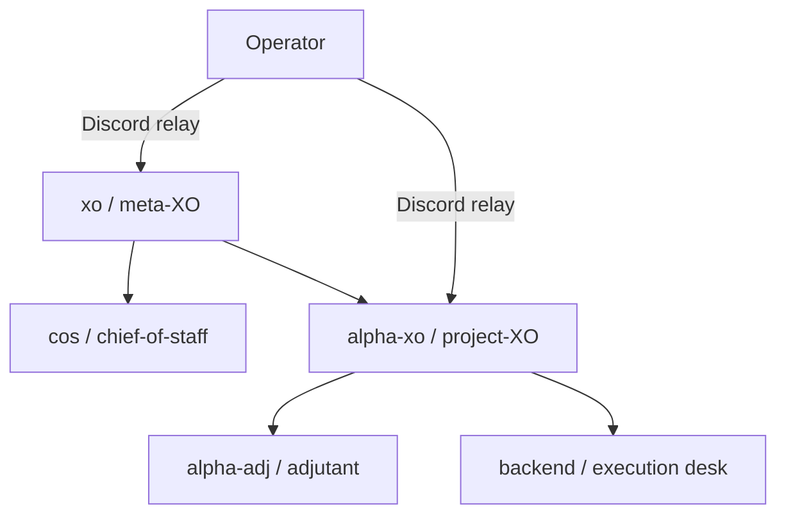

# Design — fleet bootstrap / standup

Public-safe design for standing up a federated flotilla fleet: COS, project XOs, adjutants,
and execution desks across Claude / Codex / Grok (and other registered surfaces). Examples use
`flotilla.example.json` names only.

## 1. Topology invariant — every desk has an XO

**Invariant:** Every execution agent (`fleet_role: desk` or `transient-task-desk`) MUST be
reachable under exactly one supervising project-XO via federation bindings. The meta-XO
(`xo_agent`) and optional chief-of-staff (`cos_agent`) sit above project XOs.

**Corollary:** A roster agent that owns a channel (`xo_agent` on its home binding) but lists
only itself (or only coordinators as observers) is a **desk-home** or **solo mirror** channel,
not a coordinator — see `TestIsCoordinator_SoloDeskChannelNotCoordinator`. Apparent “orphan
desks” in the dash rail or detector snapshot are **topology-discovery debt**: missing or
mis-tagged `channels[]` edges, not a product-endorsed layout.



**Bootstrap doctor action:** For each `fleet_role: desk`, assert ∃ binding where
`xo_agent` is a coordinator and `members` contains the desk (or desk owns home channel with
parent coordinators listed per visibility doc). Fail with `TOPOLOGY_MISSING_XO` and name the
desk + suggested binding shape — do not auto-mutate roster.

## 2. Explicit fleet role metadata

Today `IsCoordinator` is **derived** from bindings. Bootstrap and permissions need an
**explicit** role on each `agents[]` entry, validated at roster load against derived truth.

### 2.1 Proposed field

```jsonc
{
  "name": "alpha-xo",
  "surface": "codex",
  "fleet_role": "xo"   // NEW — explicit bootstrap/permission class
}
```

| `fleet_role` | Meaning | Permission class | Doctrine install |
|---|---|---|---|
| `cos` | Chief-of-staff (`cos_agent`) | `leadership` | coordinator + identity-append |
| `xo` | Meta- or project-XO (coordinator) | `leadership` | coordinator + identity-append |
| `adjutant` | `adjutant_for` mechanical seat | `leadership-adjutant` | adjutant charter path |
| `desk` | Long-lived execution desk | `desk-<lane>` | execution backstop |
| `transient-task-desk` | Short-lived / PR-scoped desk | `desk-transient` | execution + recycle hints |

**Validation (fail-closed at `roster.Load`):**

- `fleet_role: cos` ⇒ name equals `cos_agent` when set.
- `fleet_role: adjutant` ⇒ `adjutant_for` set and target is coordinator.
- `fleet_role: desk` | `transient-task-desk` ⇒ NOT `IsCoordinator(name)` unless operator
  explicitly overrides with `fleet_role: xo` (prevents silent mis-tags).
- Absent `fleet_role` ⇒ legacy mode: derive for doctor warnings only; implementation phase
  may warn until fleet cuts over.

**Relation to `coordinator: true`:** If present, `fleet_role` wins; `coordinator` boolean
becomes redundant and is deprecated over one roster generation.

## 3. Naming convention — `{identifier}-{role}`

Human and machine readability for federated fleets:

| Pattern | Example | Notes |
|---|---|---|
| `{flotilla}-xo` | `alpha-xo` | Project XO |
| `{flotilla}-adj` | `alpha-adj` | Adjutant for that XO |
| `{flotilla}-desk` | `alpha-desk` | Stable execution desk |
| `{flotilla}-desk-{scope}` | `alpha-desk-pr123` | Transient task desk |
| meta | `xo`, `xo-adj` | Fleet command |

**Rules:**

- `name` == tmux marker == `FLOTILLA_SELF` (unless `tmux_title` override documented).
- Transient desks SHOULD encode scope in the name (`-pr123`, `-spike-foo`) and
  `fleet_role: transient-task-desk` for permission tier + recycle policy.
- Identifier is organizational (project codename), not a deployment host name.

## 4. Permission shape — leadership vs desks

Bootstrap selects a **permission template** from `deploy/` by `fleet_role` + `surface`:

| Class | Talk to whom | Fleet state R/W | Typical unprompted allows |
|---|---|---|---|
| **Leadership** (`cos`, `xo`) | Other coordinators, operator relay, adjutant | Roster dir, backlog, goals, session-mirror, secrets path (read), ack/settled markers (write) | `flotilla notify/send/status`, `gh pr merge`, read-only git/gh |
| **Adjutant** | Parent coordinator layer | Buffer sidecars, charter, read roster/goals | Mechanical triage; no merge authority |
| **Desk** | Parent XO only (send path) | Worktree + lane artifacts | Tests, lint, branch push to feature branches; deny merge-to-default |
| **Transient desk** | Parent XO | Same as desk, narrower path globs | Stricter write surface; time-bounded |

**Existing assets (reuse, do not fork):**

- `deploy/grok-coordinator-permission-allowlist.json` — Grok **leadership**
- `deploy/grok-permission-allowlist.json` — Grok **execution**
- Codex coordinator rules — `openspec/changes/codex-coordinator-seat/design.md`
- Claude — `watch-runbook.md` § XO permission posture; desk templates via gatekeeper + settings

**Gatekeeper posture (all classes):** `on_gatekeeper_error: abstain` — documented in
coordinator template; bootstrap copies templates, does not invent per-host deny lists ad hoc.

**Noise reduction:** Leadership templates front-load **read_unprompted** + outbound flotilla
commands so coordinators are not prompted on every `flotilla send` / `touch` ack. Desks use
**prompting** or `--always-approve` per lane policy (see `deploy/grok-permission-allowlist.json`
`_comment_enforcement`) with mechanical deny hooks for merge-to-default.

## 5. State root — layout and permissions

Bootstrap treats `<roster-dir>` (directory containing `flotilla.json`) as the **fleet state
root**. Idempotent setup ensures:

| Path | Owner write | Leadership R/W | Desk R/W |
|---|---|---|---|
| `flotilla.json` | operator | read | read |
| `flotilla-secrets.env` | operator | read (env inject) | none |
| `.flotilla-state.md` / backlog | leadership | read/write | read scoped |
| `fleet-goals.json` | leadership | read/write | read |
| `flotilla-detector-state.json` | watch daemon | read | read |
| `flotilla-xo-alive` / per-layer ack | coordinator seat | write (touch) | none |
| `session-mirror/` | watch + seats | read | read (own agent file) |
| `flotilla-<agent>-buffer.json` | watch | read (adjutant) | none |

Bootstrap **does not** chmod secrets world-readable; doctor checks permissions are not group/other
writable. Host-local only — never committed.

## 6. Tmux / flotilla marker — avoid detector orphans

A seat is **detector-visible** when ALL hold:

1. **Roster entry** — agent name in `agents[]`.
2. **Pane marker** — `@flotilla_agent=<name>` via `flotilla register <name>` in the launch line
   (same line as `exec <harness>`).
3. **Launch env** — `FLOTILLA_SELF=<name>`; coordinators also `FLOTILLA_SECRETS=<path>`.
4. **Watch enrollment** — roster `change_detector: true` and `heartbeat_interval` set; daemon
   running and writing `flotilla-detector-state.json`.
5. **Surface registered** — `surface` field matches a driver the watch process loaded.

**Codex/Grok coordinator orphan pattern:** Seat runs in tmux but snapshot omits it because (a)
marker missing after `exec`, (b) `FLOTILLA_SELF` unset so notify/send provenance breaks, or (c)
watch started before surface driver registered. Bootstrap launch recipe MUST be:

```bash
tmux send-keys -t <session> \
  'export FLOTILLA_SELF=alpha-xo FLOTILLA_SECRETS=$ROSTER_DIR/flotilla-secrets.env && flotilla register alpha-xo && exec codex' Enter
```

**Idempotent check:** `flotilla bootstrap doctor --roster <path>` (proposed) verifies marker
via `flotilla status --json` / pane probe and compares to roster agent set.

## 7. Idempotent bootstrap doctor (proposed CLI)

New subcommand family: `flotilla bootstrap` with exit codes suitable for CI / agent loops.

| Check ID | Condition | Severity |
|---|---|---|
| `B001` | `go` + `tmux` on PATH | fail |
| `B002` | Roster loads; federation acyclic | fail |
| `B003` | Every desk has supervising XO binding | fail |
| `B004` | `fleet_role` consistent with `IsCoordinator` | warn→fail |
| `B005` | `change_detector` + liveness mode when adjutant present | fail |
| `B006` | Each roster agent: pane marker OR not expected live | warn |
| `B007` | `FLOTILLA_SELF` in launch recipe for live seats | warn |
| `B008` | Detector snapshot fresh (< 3× heartbeat) | warn |
| `B009` | Permission template synced for seat surface+role | warn |
| `B010` | `flotilla register` would succeed (dry-run pane list) | info |

**Idempotence:** `bootstrap apply` (future) only writes scaffold files that are missing or
older than repo template version; never overwrites operator-edited secrets or roster without
`--force`. `bootstrap doctor` is read-only.

## 8. Bootstrap skill workflow (agent-facing)

The `.claude/skills/flotilla-fleet-bootstrap/SKILL.md` skill orchestrates:

1. **Discover** — read roster; classify agents by `fleet_role` (or derive + warn).
2. **Topology audit** — list desks missing XO; emit binding snippets (generic example).
3. **State root** — verify roster dir permissions and required sidecar paths.
4. **Seat recipes** — for each live agent, emit harness-specific launch line with register +
   env exports.
5. **Permissions** — copy/sync correct `deploy/*-permission-allowlist.json` tier into worktree
   `.claude/settings.local.json` or Grok/Codex equivalent.
6. **Watch** — confirm `change_detector`; restart watch if new surface registered.
7. **Validate** — run minimal validation plan (§9); surface failures to COS, not operator spam.

## 9. Minimal validation plan

Run after bootstrap (manual or skill-driven). Any step failure blocks “fleet standup complete.”

| Step | Action | Pass |
|---|---|---|
| V1 | `flotilla bootstrap doctor --roster $R` | no fail-severity findings |
| V2 | `flotilla status --json` | every expected-live agent non-unknown state |
| V3 | Detector snapshot age | fresh within 3× heartbeat |
| V4 | Operator relay | bare message in fleet-command → meta-XO pane |
| V5 | Cross-seat send | `flotilla send --from xo backend "ping"` → delivered |
| V6 | Coordinator outbound | XO `flotilla notify` → Discord (or webhook dry-run) |
| V7 | Ack path | XO touches ack file; watch clears liveness alert |
| V8 | Permission smoke | coordinator `gh pr view` unprompted; desk `gh pr merge` blocked or prompted per policy |

Transient desks: V4–V7 optional; V1–V3 + parent XO send required.

## 10. Implementation phases

See `tasks.md`. Summary:

1. **Design + skill stub** (this PR) — docs, spec, skill pointer.
2. **Roster schema** — `fleet_role` field + validation tests.
3. **`flotilla bootstrap doctor`** — read-only checks B001–B010.
4. **Permission sync script** — `scripts/bootstrap-sync-permissions.sh` per surface.
5. **`bootstrap apply`** — scaffold launch snippets, settings.local.json from templates.
6. **`llm.md` § Fleet bootstrap** — link skill + doctor.

## 11. References

- `flotilla.example.json` — generic federation topology
- `docs/federation.md`, `docs/coordinator-seat-swap-runbook.md`
- `openspec/changes/codex-coordinator-seat/design.md`
- `deploy/grok-coordinator-permission-allowlist.json`, `deploy/grok-permission-allowlist.json`
- `llm.md` § register + `docs/watch-runbook.md` § prerequisites
- `internal/roster/roster.go` — `IsCoordinator`, adjutant validation