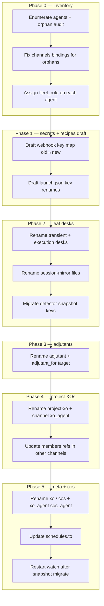

# Design — fleet-wide role-bearing rename rollout

**Planning desk deliverable.** Public-safe; examples use `flotilla.example.json` names only.
Coordinates with sibling designs:

| Sibling | Shared contract |
|---|---|
| `fleet-bootstrap-standup` (PR #520) | `fleet_role`, **ops-xo vs product XO** boundary, naming, topology, doctor B001–B010 |
| `fleet-role-permissions` (PR #521) | Permission class from `fleet_role` + `surface`; `ops-xo` fleet-ops tier; zero approval noise §0 |

**Status:** Plan for COS review. **No live rename** until operator affirms cutover after merge.

---

## 1. Target naming model

Align with bootstrap design §3:

| Pattern | Example (generic) | `fleet_role` | Notes |
|---|---|---|---|
| fleet ops | `ops-xo`, `ops-adj` | `ops-xo`, `adjutant` | **Rename execution owner** — not product XO |
| meta | `xo`, `xo-adj` | `meta-xo`, `adjutant` | Fleet command |
| `{product}-xo` | `alpha-xo` | `xo` | **Product** XO — implementation lane only |
| `{product}-adj` | `alpha-adj` | `adjutant` | Product adjutant |
| `{product}-desk` | `alpha-desk` | `desk` | Execution desk |
| `{product}-desk-{scope}` | `alpha-desk-pr123` | `transient-task-desk` | Transient desk |
| chief | `cos` | `cos` | Chief-of-staff |

**Authority boundary:** Rename waves are planned and executed by **`ops-xo`**, not product XOs
(e.g. a flotilla product lane XO). Provision `ops-xo` before rename implementation (bootstrap §2.2).

**Invariant:** `name` == `FLOTILLA_SELF` == tmux marker (unless documented `tmux_title` override).
Transient desks encode scope in the suffix and recycle at chapter end.

**Topology invariant (non-negotiable):** Every `desk` / `transient-task-desk` MUST appear under a
supervising project-XO in `channels[]`. Apparent orphan desks are **discovery debt** — resolve
bindings before renaming the desk, or the new name inherits the same orphan failure mode.

---

## 2. Identity inventory — what a rename touches

Each row is a **host-local or roster-scoped artifact** keyed by agent `name` unless noted.

| # | Surface | Location / key | Rename action | Blast radius if missed |
|---|---|---|---|---|
| I1 | Roster agent id | `flotilla.json` → `agents[].name` | Primary key change | All downstream refs break |
| I2 | Coordinator pointers | `xo_agent`, `cos_agent` | Update when meta/coordinator renames | Wrong heartbeat/clock target |
| I3 | Federation bindings | `channels[].xo_agent`, `members[]` | Rewrite hub + member refs | Discord relay misroutes |
| I4 | Adjutant binding | `adjutant_for` / `assistant_for` | Point to new coordinator name | Adjutant layer silent |
| I5 | Schedules | `schedules[].to` | Update target agent | Missed dispatches |
| I6 | Discord webhooks | `flotilla-secrets.env` → `FLOTILLA_WEBHOOK_<AGENT>` | New key (`-` → `_`, uppercased) | Desk posts fail |
| I7 | Launch recipes | `flotilla-launch.json` → `agents` map keys | Rename key + inner refs | Resume/recycle wrong seat |
| I8 | tmux session/window | launch `tmux`, pane title (`Title()`) | Rename session or keep `tmux_title` shim | Delivery ambiguous/miss |
| I9 | Harness workspace flag | `-w <name>` in launch command | Match new name | Wrong worktree binding |
| I10 | `FLOTILLA_SELF` | shell env at seat launch | Export new value | Detector orphan |
| I11 | `flotilla register` | tmux marker line | Re-register under new name | Detector orphan |
| I12 | Detector snapshot | `<roster-dir>/flotilla-detector-state.json` → `desk_states` keys | Migrate keys or cold-start | One conservative wake |
| I13 | Session mirror | `<roster-dir>/session-mirror/<agent>.jsonl` | Rename file | Dash feed gap for old name |
| I14 | Goals owner | `fleet-goals.yaml` → `owner:` fields | Update agent refs | Wrong rollup ownership |
| I15 | Backlog prose | `fleet-backlog.md` `@agent` mentions | Manual or scripted grep-replace | Stale human refs |
| I16 | Context ledger | `context-ledger.md` append-only | **Do not rewrite history**; append migration note | COS context drift |
| I17 | Handoffs | `.flotilla/handoffs/*.md`, project `.claude/handoffs/` | New handoffs use new name; old paths stay | Takeover confusion |
| I18 | Workspace overlay | `~/.flotilla/<agent>/`, worktree paths | Rename dir or symlink shim | Recipe cwd drift |
| I19 | Git branch / worktree | `feature/<agent>-*` conventions (operator) | Optional; not flotilla-enforced | Operator map only |
| I20 | Permission materialization | gatekeeper overlay / grok allowlist | Re-sync by `fleet_role` (name-agnostic) | Wrong tier if role wrong |
| I21 | Ack file | `<roster-dir>/flotilla-xo-alive` (XO-scoped, not per-desk) | Usually unchanged unless meta-XO renames | Liveness false alarm |
| I22 | Dash mental map | operator + coordinator prose | Runbook + ledger migration note | Communication drift |

**Stable identity principle:** Discord `channel_id` values are **not** renamed — only roster
agent strings and webhook secret keys change. Channel ↔ XO binding persists; `xo_agent` string
updates.

---

## 3. Dependency graph

Renames proceed **bottom-up within a project**, **project-XOs before desks**, **meta-XO last**
among coordinators (or meta first if only meta is renaming — see phase rules).



**Hard dependencies:**

- I6 (webhook) MUST be updated **before** first `flotilla notify` under new name.
- I10–I11 MUST be applied **atomically at seat restart** (same shell line).
- I3 (channels) MUST be consistent **before** watch reload — relay routes by channel, not name alone.
- I12 snapshot migration OR explicit cold-start MUST happen **once per fleet** during a maintenance window.
- I20 permission sync runs **after** `fleet_role` is correct (bootstrap permissions desk).

---

## 4. Staged rollout phases

### Phase 0 — Inventory & topology repair (no renames)

**Goal:** Complete map of old→new names; zero orphan desks.

| Step | Action | Owner |
|---|---|---|
| 0.1 | Export `flotilla status --json` + dash org graph | planning desk |
| 0.2 | Build rename matrix: `old_name`, `new_name`, `fleet_role`, `identifier`, supervising XO | planning desk |
| 0.3 | Flag orphans: desk in `agents[]` but no valid `channels[]` parent | planning desk |
| 0.4 | Emit generic binding snippets for each orphan (host-local paste) | planning desk |
| 0.5 | Operator affirms matrix + topology fixes | operator |

**Gate:** `bootstrap doctor` (future B001/B004) equivalent manual checklist passes — see §8.

### Phase 1 — Draft host-local artifacts (still old runtime names)

| Step | Action |
|---|---|
| 1.1 | Prepare `rename-plan.json` (gitignored) with ordered cutover list |
| 1.2 | Pre-create new `FLOTILLA_WEBHOOK_*` entries (Discord: new webhook or rename in place — operator choice) |
| 1.3 | Draft updated `flotilla-launch.json` keys (do not deploy) |
| 1.4 | Run `permissions doctor` (future) against **new** `fleet_role` assignments |

### Phase 2 — Leaf desk cutover (one desk at a time)

**Order:** `transient-task-desk` first (short-lived), then stable `desk` agents.

Per-desk **atomic cutover recipe** (host-local):

1. **Quiesce** — wait for idle/settled; no in-flight `flotilla send`.
2. **Checkpoint** — copy handoff + session-mirror + detector snapshot to `rename-checkpoint/<old>/`.
3. **Stop** — graceful close or recycle complete (handoff durable).
4. **Mutate roster** — single-agent JSON patch: `name`, `fleet_role`, binding `members[]` refs.
5. **Mutate secrets** — add `FLOTILLA_WEBHOOK_<NEW>`; keep old key until validation passes.
6. **Mutate launch** — rename `agents` key; update `-w`, `tmux`, `cwd` if name-embedded.
7. **Migrate files** — `session-mirror/<old>.jsonl` → `<new>.jsonl`; snapshot `desk_states` key.
8. **Relaunch** — `FLOTILLA_SELF=<new> flotilla register <new> && exec <harness>`.
9. **Validate** — V-R3, V-R4, V-R5, V-R7 (§8).
10. **Retire old webhook key** — after 24h clean operation.

**Parallelism:** Desks under **different** project-XOs may cut over in parallel. Desks sharing a
hub should serialize if hub is mid-rename.

### Phase 3 — Adjutant cutover

After parent XO name is final (or use temporary `adjutant_for` pointing to old name — **avoid**;
rename adjutant in same window as parent when parent also renames).

### Phase 4 — Project-XO cutover

Higher blast radius — coordinates multiple desks.

1. Announce maintenance slice to operator.
2. Verify all child desks already on new names (or update `members[]` in one roster commit).
3. Rename `channels[].xo_agent` for project home channel.
4. Update fleet-command `members[]` if project-XO listed there.
5. Update `adjutant_for` on child adjutants.
6. Relaunch project-XO seat with new `FLOTILLA_SELF`.
7. Validate V-R1, V-R2, V-R6, V-R8.

### Phase 5 — Meta-XO + COS

Last among coordinators (heartbeat clock, `xo_agent`, `cos_agent`).

1. Migrate `schedules[].to` if meta renamed.
2. Update `xo_agent` / `cos_agent` fields.
3. Restart `flotilla-watch` (surface driver reload if Codex/Grok coordinator).
4. Cold-start or migrate detector snapshot; expect **one** conservative wake (documented).
5. Append context-ledger migration stanza (I16 — no historical rewrite).
6. Validate V-R9–V-R12.

---

## 5. Compatibility / shim strategy

### 5.1 Today (no roster alias field)

flotilla has **no** `former_names` / alias map in `roster.Load`. Cutover is **atomic per agent**
with a checkpoint directory — not a dual-name steady state.

**Allowed shims:**

| Shim | Mechanism | Duration |
|---|---|---|
| `tmux_title` hold | Keep old pane title while `name` changes | Until relaunch confirms match |
| Webhook dual-key | Old + new `FLOTILLA_WEBHOOK_*` both present | Until V-R5 passes |
| Snapshot cold-start | Delete `desk_states` entry for old name | One wake; acceptable |
| Symlink workspace | `~/.flotilla/<old>` → `<new>` | Max one roster generation |
| Ledger append-only | Migration note in `context-ledger.md` | Permanent |

**Forbidden shims:**

- Two `agents[]` rows for one seat (duplicate detector entries).
- Partial `channels[]` update (hub new, members old).
- Rewriting historical ledger/handoff prose in place (breaks audit trail).

### 5.2 Proposed future: `former_names[]` (implementation PR, post-plan)

```jsonc
{
  "name": "alpha-desk-pr123",
  "fleet_role": "transient-task-desk",
  "former_names": ["grok-desk"]   // load-time: reject duplicate; deliver/send resolve alias
}
```

Enables a **soft cutover window** where `flotilla send grok-desk` forwards to `alpha-desk-pr123`
with a deprecation log. **Not in scope for execution** until a follow-up implementation PR merges.

### 5.3 Permission coordination

Renames do **not** require new permission templates — `fleet_role` + `surface` drive the
canonical policy (`deploy/flotilla-permissions/canonical-roles.json`). After each cutover:

```bash
# Future:
flotilla bootstrap permissions sync --agent <new_name> --roster "$FLOTILLA_ROSTER"
```

Re-materialize harness config when **role class** changes (desk → transient), not on mere
identifier change within the same role.

---

## 6. Orphan desk resolution (topology debt)

Before renaming an orphan desk `D`:

1. Identify intended supervising project-XO `X` (operator decision).
2. Add binding: `{ "channel_id": "...", "xo_agent": "D", "members": ["X", ...] }` **or** add `D`
   to an existing project channel's `members[]` if `D` is a pure execution desk.
3. Set `fleet_role: desk` (or `transient-task-desk`).
4. Run topology validation (manual today; future B004).

**Rename mapping example (generic):**

| Before (debt) | After (valid) |
|---|---|
| `grok-desk` owns channel, members only `frontend` (mis-tagged) | `alpha-desk` with `members: ["alpha-xo"]`, `fleet_role: desk` |
| `backend` listed only in fleet-command, no project parent | `alpha-desk` under `alpha-xo` channel |

Public repo examples stay in `flotilla.example.json` — do not paste live fleet names into PRs.

---

## 7. Rollback

Each per-agent checkpoint (`rename-checkpoint/<old>/`) contains:

- `roster-agent.json` (prior agent object)
- `flotilla-detector-state.json` fragment
- `session-mirror/<old>.jsonl` copy
- `handoff-latest.md` if recycle was in progress

**Rollback recipe (per agent):**

1. Stop seat.
2. Restore roster agent name + bindings from checkpoint.
3. Restore secrets webhook key (remove new key).
4. Restore launch recipe key.
5. Restore session-mirror filename.
6. Restore snapshot `desk_states` key or cold-start.
7. Relaunch with old `FLOTILLA_SELF`.
8. Log rollback in context-ledger.

**Fleet-wide rollback:** Only if Phase ≤2 incomplete. Phase 4+ rollback requires coordinated
multi-agent restore — prefer **forward fix** unless operator declares incident.

---

## 8. Validation commands

Run after each cutover (host-local; generic commands):

| ID | Command / check | Pass criterion |
|---|---|---|
| V-R1 | `flotilla status --json` | New name present; state not `unknown` after one detector tick |
| V-R2 | `flotilla send <new> 'rename smoke ping'` | Confirmed delivery; mirror if enabled |
| V-R3 | `flotilla notify <new> 'webhook smoke'` | Discord post visible in desk channel |
| V-R4 | `tmux list-panes -a -F '#{pane_title}' \| grep -F '<title>'` | Exactly one pane match |
| V-R5 | `grep FLOTILLA_WEBHOOK_<NEW> secrets.env` | Key present and non-empty |
| V-R6 | Operator `@<new>` in bound Discord channel | Relay routes to correct hub |
| V-R7 | `ls session-mirror/<new>.jsonl` | File exists; dash feed updates |
| V-R8 | `flotilla bootstrap doctor` (future) | B001–B010 pass for renamed fleet |
| V-R9 | Watch logs: no `no webhook for` / `ambiguous` | Clean for 15 min |
| V-R10 | Goals dash: `owner` fields show new name | Rollup correct |
| V-R11 | `permissions doctor` (future) | P001–P003 pass for leadership seats |
| V-R12 | `scripts/check-private-boundary.sh` on any public doc commit | No deployment names leaked |

**Inventory validation (Phase 0):**

```bash
# Generate agent list from roster
jq -r '.agents[].name' "$FLOTILLA_ROSTER"

# Orphan heuristic: agent not in any members[] and not xo_agent of a channel and not xo_agent/cos_agent
# (implement in future flotilla bootstrap doctor B004)
```

---

## 9. Public / private partition review

| Artifact | Public repo | Host-local / private |
|---|---|---|
| Rename plan matrix with **real** old/new names | **NEVER** | `rename-plan.json` (gitignored) |
| Generic rename **patterns** and checklists | This design | — |
| `flotilla.example.json` illustrative renames | Yes (generic ids) | — |
| `rename-checkpoint/` backups | **NEVER** | Roster dir or operator backup |
| Discord `channel_id`, webhook URLs | **NEVER** | `flotilla-secrets.env` |
| Context ledger migration note content | **NEVER** (names deployments) | Append on host |
| Implementation of `flotilla rename doctor` | Future public code | Runs against private roster |

**PR discipline for follow-up implementation:** Tests use `alpha-xo`, `alpha-desk-pr123` only.
Reference `docs/private-public-boundary.md` before any fixture commit.

---

## 10. Operator mental map

Maintain a **single-page rename roster** (private) with columns:

`old_name | new_name | fleet_role | identifier | parent_xo | cutover_phase | status | checkpoint_path`

Coordinators reference **new names exclusively** after Phase 4. During Phases 2–3, dual-reference
is allowed in operator comms only — not in `flotilla send` targets.

Handoff template addendum for rename chapter:

> **Rename in progress:** This seat was `<old>`, now `<new>`. Update `@` refs. Parent XO:
> `<parent-xo>`. Do not revert roster without checkpoint.

---

## 11. Implementation follow-ups (post-plan, separate PRs)

| PR lane | Deliverable |
|---|---|
| `fleet-bootstrap-standup` | `fleet_role` load validation; `flotilla bootstrap doctor` |
| `fleet-role-permissions` | `permissions sync` after rename |
| **New:** `fleet-rename-tooling` | `flotilla rename plan`, `flotilla rename doctor`, `former_names[]` |
| **New:** dash | Show `former_names` deprecation badge (optional) |

---

## 12. Planning desk charter

**Seat:** `rename-rollout-plan` under **`ops-xo`** supervision (transient-task-desk or `ops-adj`),
not a product XO desk.

**Inputs:** Operator rename enqueue notice, current roster export, sibling PRs #520/#521.

**Outputs:** Host-local `rename-plan.json`, topology fix snippets, phased schedule — **not** committed
to public tree.

**Does not:** Execute live renames, edit private roster in public PRs, self-merge plan PR.