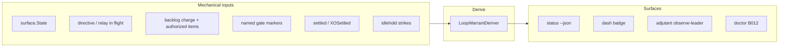

# Design — loop warrant status (compact, behavior-driven)

**Status:** Operator-refined direction (`flotilla-dispatch-4516dd94`). Supersedes the earlier
multi-posture vocabulary (`available` / `parked` / `maintaining` / `refining` / `cleaning` as
peer labels). **One coherent fork** — implement warrant first; derive display badges mechanically.

## 1. Problem statement

An autonomous fleet is a **loop**. Officers must answer:

> Does this seat have an active **warrant** for its current loop position — or is plain **idle**
> hiding lack of accountability?

| Officer need | Plain `idle` suggests (wrong) |
|---|---|
| Executing a directive | inactive |
| Improving an assigned charge | nothing to do |
| Paused at a **named gate** (real blocker) | idle |
| **No warrant** (idle-hold, permission-seeking) | also idle |

Pane `surface.State` stays harness-faithful. Fleet layer adds **loop warrant**.

## 2. Two-layer model (load-bearing)

| Layer | Field | Question |
|---|---|---|
| Pane | `state` | What does the harness show? (`working`, `idle`, `shell`, …) |
| Loop | `loop_warrant` | What **justifies** this seat's participation (or lack of it)? |

Optional derived **`loop_display`** — compact badge for dash/status text; behavior-driven, not a
second taxonomy to learn.



**Disambiguate third layer:** `ActivityLevel` (adaptive detector cadence) = **fleet coordination
tier**, not loop warrant.

## 3. Loop warrant vocabulary (v1 — compact)

### 3.1 Accountability warrants (in-loop)

| `loop_warrant` | Meaning | Officer one-liner |
|---|---|---|
| **directive** | Acting on a **current directive** — operator relay, coordinator dispatch, or explicit turn task in flight | "on a directive" |
| **charge-improvement** | **Standing charge-improvement** — authorized work on assigned charge (backlog/goal items unblocked, not permission-seeking) | "improving its charge" |
| **named-gate** | **Named gate** justifies non-action — real gate, not tacit idle | "gated: \<kind\>" |

**Named gate kinds** (`gate_kind`, drill-down only — do not split primary badge unless behavior
differs):

| `gate_kind` | Justification | Mechanical signals |
|---|---|---|
| `awaiting-auth` | Operator gate (spend / irreversible / fork) | awaiting marker OR dominant `[awaiting-auth]` |
| `blocked` | Tracked external dependency | `[blocked]` / `[needs-attention]` with no unblocked ahead |
| `harness-prompt` | Harness approval/input (not mid-turn composing) | pane awaiting-input / awaiting-approval |

**Do not conflate** `named-gate` with adjutant **operator protected window** — protected window is
inject policy, not the leader's warrant (leader may be `directive` while protected).

### 3.2 Unwarranted (coordination debt)

| `loop_warrant` | Meaning | Signals |
|---|---|---|
| **unwarranted** | **No active warrant** — plain idle smell | `StateIdle` + unsettled + idle-hold strikes ≥ threshold + no unblocked backlog + no named gate + no in-flight directive |

Idle-hold permission-seeking without a real gate → **unwarranted**, not a separate "drifted"
posture label. Display may still say "unwarranted" or "out of loop" — one concept.

### 3.3 Technical fault (not warrant semantics)

| `loop_warrant` | Meaning |
|---|---|
| **crashed** | `StateShell` without intentional recycle context |
| **reaped** | Intentional recycle / close in flight |
| **unknown** | Absent from snapshot / unreadable |

## 4. Behavior-driven display (`loop_display`)

Derived for operators; **not** an independent taxonomy. Rules (first match):

| `loop_display` | When | Behavior that differs |
|---|---|---|
| **acting** | `loop_warrant` ∈ {directive, charge-improvement} AND pane `working` (or in-turn compose) | Harness mid-turn |
| **between-turns** | Warranted, pane `idle`, **not** settled | Detector **will** self-wake / heartbeat |
| **parked** | Warranted breakpoint: settled consumed **and** backlog gate empty | Detector **suppresses** self-wake |
| **gated** | `loop_warrant` = named-gate | Non-action justified; drill `gate_kind` |
| **unwarranted** | `loop_warrant` = unwarranted | Escalation / evaluation tick candidate |
| **crashed** / **unknown** | fault states | Recovery path |

**Operator refinement (4516dd94):** Do **not** expose separate badges for `available` vs `settled`
or `parked` vs `awaiting-auth` unless behavior differs. Here:

- `between-turns` vs `parked` **differs** — wake policy (row above).
- `gated` **collapses** awaiting-auth and blocked in the primary badge; kinds on drill-down.

Removed as primary labels: `maintaining`, `refining`, `cleaning` — these are **charge-improvement**
with optional `warrant_detail` text from backlog markers (`[maintaining]`, etc.), not new postures.

## 5. Derivation precedence (deterministic)

1. `unknown` — no snapshot row
2. `crashed` / `reaped` — shell + recycle context
3. `directive` — in-flight operator relay, pending dispatch claim, or top backlog item marked directive/in-flight turn
4. `named-gate` — awaiting marker OR dominant gate backlog OR harness-prompt pane state
5. `charge-improvement` — unblocked authorized backlog/goal items
6. `parked` display path — settled + empty unblocked backlog (warrant = charge-improvement with breakpoint consumed, OR explicit parked charter — implementation uses settled+empty as mechanical parked)
7. `unwarranted` — idle-hold pattern
8. `between-turns` — idle, warranted, not settled
9. fallback: if idle with settled+empty → display `parked`; if idle with work queued → `between-turns`

**Parked strictness:** settled **and** zero unblocked backlog required for `loop_display=parked`.
Settled with unblocked work → `between-turns` + doctor `LOOP_WARRANT_STALE` (charge warrants action).

## 6. Status JSON contract (additive)

```jsonc
{
  "agents": [
    {
      "name": "xo",
      "state": "idle",
      "loop_warrant": "charge-improvement",
      "loop_display": "parked",
      "warrant_detail": "settled, backlog empty",
      "gate_kind": null
    },
    {
      "name": "alpha-desk",
      "state": "working",
      "loop_warrant": "directive",
      "loop_display": "acting",
      "warrant_detail": "dispatch: rebase PR"
    },
    {
      "name": "cos",
      "state": "idle",
      "loop_warrant": "named-gate",
      "loop_display": "gated",
      "gate_kind": "awaiting-auth"
    }
  ]
}
```

Deprecate operator copy `settled (idle)` → `parked` or `gated` per derivation. Keep `state: idle`
in JSON for harness fidelity.

## 7. Machinery mapping

| Existing | Warrant interaction |
|---|---|
| `StateWorking` | Usually `directive` or `charge-improvement` → display `acting` |
| `StateIdle` + unsettled + backlog | `charge-improvement` → `between-turns` |
| `StateIdle` + settled + empty backlog | → display `parked` |
| `AwaitingMarker` | `named-gate` / `awaiting-auth` |
| Backlog blocked items | `named-gate` / `blocked` |
| `idlehold` strikes | `unwarranted` |
| Goal-loop gate | unblocked items veto `parked` |

## 8. Adjutant / laminar integration

Observe **`loop_warrant`** and `loop_display`, not pane idle alone:

| Leader | Adjutant policy |
|---|---|
| `acting` | Buffer non-urgent; respect `OperatorProtectedWindow` |
| `between-turns` | Preferred seam for consolidated brief |
| `parked` | Seam inject allowed (non-urgent) |
| `gated` | Mechanical protected window when operator-facing gate |
| `unwarranted` | Evaluation tick → act-by-tier; escalate |

## 9. Bootstrap §2.5 amendment (for merged #520 follow-up)

Replace posture list with warrant vocabulary:

- Field: `loop_warrant` (+ `loop_display`, `gate_kind` optional)
- Doctor **B012**: every `live_expected` agent has derivable warrant when snapshot fresh
- Validation **V10**: fixtures distinguish `parked` vs `between-turns` vs `gated` vs `unwarranted`

## 10. Implementation phases

See `tasks.md`. Order: pure deriver tests → status JSON → dash badge → doctor B012 → adjutant wire.

## 11. Related

- `openspec/changes/fleet-bootstrap-standup/` §2.5 (amend after this fork affirms)
- `openspec/changes/adjutant-operator-protected-window/`
- `openspec/changes/archive/2026-06-16-goal-driven-loop`
- `openspec/changes/idle-hold-antipattern` → maps to `unwarranted`