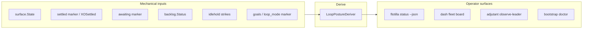

# Design — loop-aware status taxonomy

**Status:** Direction-level proposal (operator-affirmed gap, 2026-07-08). Awaits gate before
implementation.

## 1. Problem statement

An autonomous fleet is a **loop** — detect → wake → act → settle/park → detect again. Officers
must answer:

> Is this seat **in the loop** (building, iterating, refining, maintaining, cleaning, or parked at
> a legitimate breakpoint), or **out of the loop** (drifted, crashed, reaped, unknown)?

Today's operator surfaces conflate layers:

```
PANE LAYER (surface.State)          FLEET LAYER (missing)
─────────────────────────         ─────────────────────
working                             ??? (in loop — good)
idle + not settled                  ??? (available — IN loop)
idle + settled                      "settled (idle)" — sounds OUT of loop
idle + idle-hold strikes            ??? (drifted — OUT of loop)
shell                               "crashed"
```

`ActivityLevel.Idle` in adaptive detector cadence is a **third** overloading — fleet coordination
tier, not agent loop posture. Documentation MUST disambiguate all three layers.

## 2. Two-layer model (load-bearing)

| Layer | Owner | Question it answers | Stable API |
|---|---|---|---|
| **Pane posture** | `surface.State` | What does the harness show right now? | `state` (existing) |
| **Loop posture** | watch detector + markers | Is this agent properly in the autonomous loop? | `loop_posture` (new) |

**Rule:** Never map loop posture 1:1 from pane state alone. Derivation MUST consult settled
markers, awaiting marker, backlog parse, goal-loop gate, and idle-hold strike counter.



## 3. Loop posture vocabulary (v1)

### 3.1 In-loop postures (proper participation)

| `loop_posture` | Meaning for officers | Primary signals |
|---|---|---|
| **composing** | Mid-turn; harness is working | `surface.StateWorking` on substantive turn work |
| **available** | Between turns; loop owns next wake | `StateIdle`, NOT settled, NOT awaiting-authority/blocked/drifted |
| **parked** | Authorized quiescence; loop suppresses self-wake | settled marker consumed / per-desk settled / `XOSettled` **AND** backlog gate reports zero unblocked items |
| **awaiting-authority** | Operator gate (spend / irreversible / fork) | awaiting marker OR backlog `[awaiting-auth]` dominates |
| **blocked** | Tracked external dependency OR harness gate prompt | backlog `[blocked]` / `[needs-attention]` with no unblocked ahead; **or** pane `awaiting-input` / `awaiting-approval` (surface blocked states — distinct from `composing`) |
| **maintaining** | Fleet hygiene / ops (bootstrap, permissions, doctor) | optional `[maintaining]` backlog/goal marker OR `fleet_role: ops-xo` task class |
| **refining** | Iteration without net-new build (review, docs, polish) | optional `[refining]` marker |
| **cleaning** | Wrap-up hygiene (handoff, stash, branch tidy) | optional `[cleaning]` marker OR recycle-pending charter |

**Operator-readable one-liners:**

- **composing** — "in the loop, mid-turn"
- **available** — "in the loop, between turns"
- **parked** — "in the loop, parked at breakpoint" (NOT inactive)
- **awaiting-authority** — "in the loop, waiting on you for a real gate"
- **blocked** — "in the loop, blocked on a named dependency"
- **maintaining / refining / cleaning** — "in the loop, doing `<mode>` work"

### 3.2 Out-of-loop postures (coordination debt)

| `loop_posture` | Meaning | Primary signals |
|---|---|---|
| **drifted** | Idle-hold antipattern; permission-seeking without a real gate | `StateIdle` + unsettled + idle-hold strikes ≥ threshold + no unblocked backlog |
| **crashed** | Process gone | `StateShell` without recent intentional recycle |
| **reaped** | Intentional session end / recycle gap | recycle/close in flight or post-recycle window (charter sidecar) |
| **unknown** | No detector truth | absent from snapshot / unreadable snapshot |

### 3.3 Precedence (deterministic derive)

Evaluate top-down; first match wins:

1. `unknown` — no snapshot entry
2. `crashed` / `reaped` — shell + recycle context
3. `composing` — working (or in-turn awaiting-*)
4. `awaiting-authority` — awaiting marker OR dominant `[awaiting-auth]`
5. `blocked` — no unblocked backlog items, blocked items present
6. declared mode — `[maintaining]` / `[refining]` / `[cleaning]` on top unblocked item
7. `parked` — settled
8. `drifted` — idle-hold pattern
9. `available` — idle, not settled, loop re-engage expected
10. fallback `available`

**Fork (operator choice at gate):** Whether `parked` requires BOTH settled marker AND empty
unblocked backlog (strict) or settled alone (lenient). **Recommendation: strict** — parked with
unblocked backlog is a **product defect** (goal-loop gate should prevent); surface as `available`
+ alert `LOOP_POSTURE_DRIFT` in doctor.

## 4. Relationship to existing machinery

| Existing concept | Layer | Loop posture interaction |
|---|---|---|
| `surface.StateIdle` | Pane | Maps to composing/available/parked/drifted — NOT directly "idle" |
| `XOSettled` / desk settled | Loop signal | → `parked` when no unblocked work |
| `AwaitingMarker` | Loop signal | → `awaiting-authority` |
| Backlog gate (`goal-driven-loop`) | Loop signal | unblocked items veto parked; drive → `available`/`composing` |
| `idlehold` strikes | Loop signal | → `drifted` |
| `ActivityLevel` (adaptive cadence) | Fleet tier | Rename in docs: **coordination tier**, not loop posture |
| Adjutant laminar flow | Observer | Leader `composing` ≠ operator protected window; `parked`/`available` = seam candidates |

## 5. Status / dash contract (proposed JSON)

Extend `flotilla status --json` (backward compatible — additive fields):

```jsonc
{
  "generated_at": "2026-07-08T12:00:00Z",
  "xo": "xo",
  "agents": [
    {
      "name": "xo",
      "role": "hub",
      "surface": "claude-code",
      "state": "idle",              // pane layer (unchanged)
      "loop_posture": "parked",     // NEW — fleet layer
      "loop_detail": "settled, backlog empty"  // optional human gloss
    },
    {
      "name": "alpha-desk",
      "surface": "grok",
      "state": "working",
      "loop_posture": "composing"
    }
  ]
}
```

**Deprecate operator copy:** replace `settled (idle)` with `parked (in loop)` in text status;
keep `state: idle` in JSON pane field for harness fidelity.

Dash fleet board: primary badge = `loop_posture`; pane `state` as secondary/subtitle.

## 6. Backlog / goal marker extension (optional declared modes)

Extend goal-loop item convention (`goal-driven-loop` design) with optional loop-mode markers:

```
- [next] [maintaining] permissions compiler smoke
- [in-flight] [refining] reader-modeling pass on PR #521
- [in-flight] [cleaning] handoff + stash before rotate
```

Parser: first `[maintaining|refining|cleaning]` on the top actionable line sets declared mode;
mechanical rules still apply (cannot be `parked` with unblocked items).

## 7. Bootstrap integration (§2.5 amendment for PR #520)

Add to fleet-bootstrap-standup design:

- **B012** — `loop_posture` derivable for every `live_expected` agent; fail `LOOP_POSTURE_UNKNOWN`
  when snapshot stale/absent on live seat.
- **V10** — synthetic fixtures: available vs parked vs drifted vs awaiting-authority distinguishable
  in `flotilla status --json`.
- Doctor info when `loop_posture=drifted` on leadership seat.

## 8. Adjutant / laminar flow integration

`adjutantDualObservationContract` and mechanical `OperatorProtectedWindow` observe **loop_posture**
on the leader stream:

| Leader loop_posture | Adjutant seam policy |
|---|---|
| `composing` | Buffer non-urgent; no leader inject if operator protected |
| `available` | Preferred seam for consolidated brief |
| `parked` | Seam inject allowed (non-urgent) |
| `awaiting-authority` | Protected window (mechanical) |
| `drifted` | Evaluation tick → act-by-tier; may escalate to parent layer |
| `maintaining`/`refining`/`cleaning` | Buffer routine finish-edges; urgent still cuts through |

## 9. Implementation phases

See `tasks.md`. Summary:

1. **Spec + pure deriver** (`internal/watch/loopposture/`) with table-driven tests
2. **Snapshot persistence** — optional `loop_postures` map in detector snapshot (or compute at read)
3. **status --json** + dash board badge
4. **Bootstrap doctor B012 / validation V10**
5. **Docs disambiguation** — xo-doctrine, watch-runbook, dash design colors (`--ok` ≠ "idle")

## 10. Open fork (surface at gate)

**Strict vs lenient parked:** Should `parked` require empty unblocked backlog?

| Option | Pros | Cons |
|---|---|---|
| **Strict (recommended)** | Aligns with goal-loop gate; parked means truly quiescent | More alerts during migration |
| **Lenient** | Matches today's settled flag only | Hides passive-holding defect |

Operator pick at gate; default **strict** in spec.

## 11. Related changes

- `openspec/changes/archive/2026-06-16-goal-driven-loop` — backlog gate
- `openspec/changes/adjutant-operator-protected-window` — protected window ≠ composing
- `openspec/changes/fleet-bootstrap-standup` — §2.5 taxonomy + doctor
- `openspec/changes/flotilla-dash` — fleet board primary badge
- `openspec/changes/adaptive-detector-cadence` — rename ActivityLevel docs